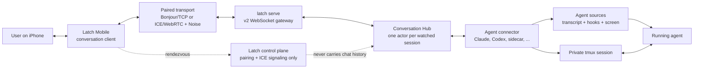
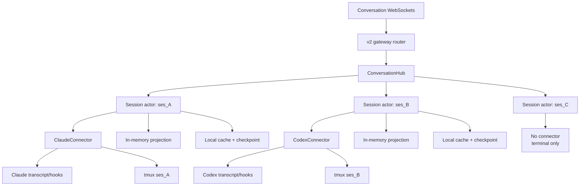
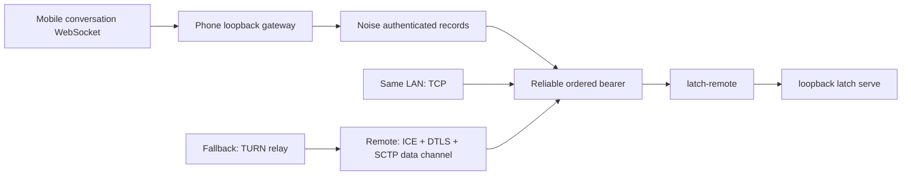
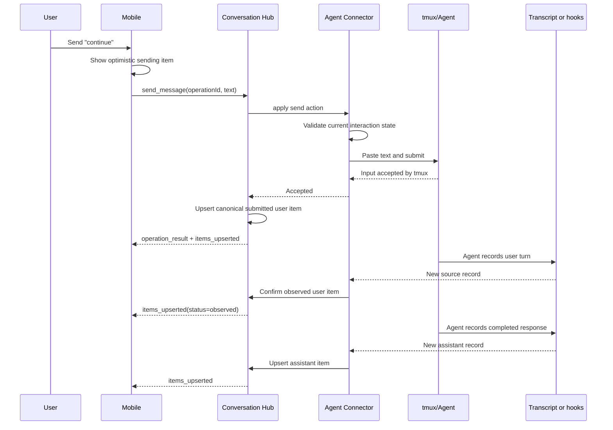

# Latch Conversation Architecture

**Status:** Proposed replacement architecture for review.

**Implementation plan:**
[`CONVERSATION_IMPLEMENTATION_PLAN.md`](./CONVERSATION_IMPLEMENTATION_PLAN.md)

**Revision 2.** Amended after
[`CONVERSATION_ARCHITECTURE_REVIEW.md`](./CONVERSATION_ARCHITECTURE_REVIEW.md).
The shape is unchanged. What changed: the device grant now reaches the Hub and
is enforced per operation; the Hub owns ordinal assignment and connectors never
assign one; an on-branch rewind truncates within a generation instead of
resetting it; `ConversationState` has a stated refresh cadence rather than being
assumed free; the connector trait gained the four things the Hub was otherwise
forced to infer. Each change is marked **[R2]** where it appears.

**Revision 3.** The release boundary is now an unconditional clean break. No v1
route, discovery tombstone, command adapter, or staged compatibility build remains.
This revision also makes crash-time operation ambiguity and incremental branch-index
persistence explicit; neither can safely be hidden behind an exactly-once claim.

## Purpose

Latch already keeps an interactive agent alive in a private tmux session and can
connect a paired phone to the computer hosting that session. The next product layer is
a chat-quality interface over the same live agent: fast to open, resilient to mobile
disconnects, and independent of any one agent's transcript format.

This document defines that layer from first principles. It deliberately replaces the
current harness-event, events-WebSocket, transcript-reducer, session-capabilities, and
send pipeline. There is no compatibility requirement because Latch has one user and
the desktop app, mobile app, CLI, and packages can move together.

The central decision is:

> The computer hosting the tmux session also hosts a Conversation Hub. One connector
> per watched session converts agent-specific sources and actions into one standard
> conversation model. Clients consume snapshots and stable item updates, not raw
> agent transcripts or low-level harness events.

## Product invariants

1. **The agent session is authoritative.** The conversation is a replaceable
   projection of the agent's real transcript, hooks, and terminal state. It is not a
   second conversation that can continue independently.
2. **The terminal remains the universal fallback.** A session without a connector is
   still a fully usable Latch terminal session. Latch does not fabricate chat
   semantics from arbitrary terminal output.
3. **Agent agnosticism lives at the connector boundary.** The network protocol,
   conversation model, and mobile UI know nothing about Claude, Codex, transcript
   paths, screen glyphs, or hook formats. Connectors contain that knowledge.
4. **New work is proportional to new agent activity.** Appending one source record
   must not re-read or re-normalize an entire transcript.
5. **One source observation feeds every client.** Connecting a second client must not
   start a second transcript parser or duplicate connector work.
6. **Mobile reconnect is normal.** A phone that locks, changes network, or loses its
   socket resumes by revision or receives a fresh snapshot without protocol error
   choreography.
7. **Whole assistant messages are sufficient initially.** The model supports upserts
   so partial text can be added later without a new protocol, but token streaming is
   not required for the first implementation. **[R2]** The `partial` message status is
   reserved in the v2 schema from the start, and clients must tolerate a status they
   do not know; adding it later would otherwise be a breaking change for every client
   that switches exhaustively, which is precisely what the upsert model exists to
   avoid.
8. **No external state service is required.** Live state is owned in-process on the
   session host. Redis, a hosted message broker, and a cloud transcript store are not
   part of this architecture.
9. **[R2] The device grant is enforced where the operation is applied.** Latch's
   observe/interact/control grant is currently enforced at the remote proxy by
   inspecting one HTTP request line. A conversation socket carries many operations
   over one request, so that boundary can no longer see them. The grant travels to
   the Hub, and the Hub refuses an operation the grant does not cover. Advertised
   availability remains user-interface guidance; the grant check is not.
10. **[R2] Observation order is the conversation's order.** A conversation is fed by
    more than one append-only source, written by more than one process, with no
    shared clock. Items are ordered by when the Hub observed them and are never
    renumbered. Source timestamps are display metadata.

## System context



The control plane helps two already-paired devices find a path. It does not receive,
store, order, or relay conversation content. Direct LAN traffic continues to prefer
Bonjour/TCP. ICE/WebRTC and TURN remain reachability mechanisms when a direct LAN path
is unavailable.

## Runtime architecture on the computer

The Conversation Hub runs inside the existing long-lived `latch serve` process. It is
not a new daemon and does not sit between tmux and the agent.



The Hub maintains a map from Latch session ID to a session actor. A session actor owns:

- exactly one connector instance;
- the normalized current conversation;
- a conversation generation and monotonically increasing revision;
- the current agent and interaction state;
- a bounded operation-id ledger for retry-safe user actions;
- the device grant carried by each subscriber;
- subscriber broadcast channels;
- connector source offsets and checkpoints;
- a local normalized cache used for restart and history pagination.

**[R2] A session runtime separates state from blocking I/O.** Applying a user action
means several blocking `tmux` invocations — a session query, a pane capture, a paste
buffer, a submit — and polling can also block on file or screen I/O. If either runs on
the actor's mailbox, one wedged process stops broadcast for every subscriber.

| Component | Runs on | Blocking | Owns |
| --- | --- | --- | --- |
| State actor | the actor mailbox | never | items, revision, generation, fanout |
| Observation worker | one scheduled task per session | bounded, with a deadline | source checkpoint and `connector.poll` |
| Action worker | a blocking pool, one action at a time per session | bounded, with a deadline | `connector.apply` |

Polls and actions execute off the state actor and return immutable results as mailbox
messages; only the actor applies mutations and advances revisions. A wedged agent
therefore costs one timed-out poll or pending operation, not the session's broadcast.
Every child process has an enforced kill deadline. A timeout during read-only preflight
is a refusal; a timeout after mutation begins is `ambiguous`, because killing the
process cannot prove whether tmux applied the input. The client never retries that case
automatically.

Actors are lazy. Opening a conversation starts its actor; additional subscribers share
it. An actor may remain warm for an idle period after the final subscriber leaves, then
stop its connector task while leaving its local cache intact. The connector catches up
from its checkpoint when the actor starts again.

`latch serve` is the only writer to the new conversation cache. Starting a second
gateway for the same `LATCH_HOME` fails visibly by acquiring an exclusive gateway lock.
This is simpler than coordinating multiple in-process Hubs over a shared cache.

## Transport decision

The application protocol is a long-lived JSON WebSocket. For paired remote access,
that WebSocket rides the transport Latch already has:



WebRTC is therefore transport infrastructure, not the conversation API. Latch does
not introduce a second custom application protocol directly on a data channel. A
single open conversation WebSocket amortizes ICE, DTLS, Noise, and WebSocket setup
over the entire chat session.

The first implementation keeps the current one-bearer-per-loopback-connection model.
If measurements later show connection setup to be material, one paired peer connection
may multiplex logical terminal, conversation, and control channels. That optimization
is explicitly deferred because it is not needed to make message delivery fast.

## Conversation model

Clients render stable conversation items rather than folding a low-level event stream.
Every item has a stable ID, creation time, position, and kind.

```text
ConversationItem
  id              stable within one conversation generation
  ordinal         observation order, assigned by the Hub, never renumbered
  createdAt       source timestamp; display metadata only
  kind
    message       role: user | assistant; text; status
    tool          name; summary; status; optional parent message id
    request       request id; permission | question; prompt; choices; status
```

**[R2] Connectors do not assign ordinals**, and do not assign revisions or
generations either. A connector emits `(id, kind, payload, createdAt)` in the
order it observed things; the Hub stamps the ordinal at ingest. This is what
makes a multi-source conversation orderable at all: the Claude transcript is
written by the agent and the hook sidecar is written by a separate Latch
process, so a hook record can be observed after a transcript item that carries
an earlier `createdAt`. Sorting by timestamp would let two clients render
different orders and would make `beforeOrdinal` pagination unsound. Clients sort
by `ordinal`. `createdAt` is shown, never ordered by.

Initial statuses are intentionally small:

```text
message.status  submitted | observed | partial | complete | failed
tool.status     running | succeeded | failed
request.status  pending | resolved | dismissed
```

**[R2] `partial` is reserved, not emitted.** Nothing produces it in the first
implementation. It exists in the schema so that adding assistant streaming later
is additive rather than a breaking change for clients that switch exhaustively
over the status. Clients must render an unknown status as `complete` rather than
failing to decode.

Agent lifecycle and action availability are conversation state, not timeline rows:

```text
ConversationState
  phase           starting | idle | working | awaiting_input | exited | unavailable
  sendMessage     enabled + optional reason
  pendingRequest  derived: the newest request item still `pending`, or null
  connector       id + version
```

**[R2] `pendingRequest` is a projection of the items, not an independent
field.** The reducer computes it from item status. If the connector tracked
pending-ness separately from the request item's own status, the two would
diverge, and the divergence would present to a person as a button that does
nothing. One source of truth: `request.status`.

`phase: starting` **[R2]** also covers a supported connector whose source
binding has not been observed yet — see *Source binding* below. A conversation
that is starting is not a conversation that is broken, and the two must not look
alike.

The connector uses native source identifiers whenever possible: transcript record UUID,
tool-use ID, or request ID. When no native identifier exists, it derives a deterministic
ID from the connector epoch and source record identity. Items are upserted by ID.
Concurrent tool calls therefore do not match merely by tool name, and partial assistant
text can later update one existing message.

## Generation and revision

Every conversation snapshot carries two ordering values:

- `generation`: an opaque identity for one derivation of the conversation;
- `revision`: a monotonically increasing integer within that generation.

Appending or updating an item increments the revision. A connector source truncation,
active-branch replacement, incompatible connector change, or unrecoverable cache
mismatch rebuilds the projection and creates a new generation.

**[R2] A rewind onto the existing branch is not a new generation.** Interrupting
an agent and re-prompting, or rewinding to an earlier turn, is routine — not an
exceptional event — and it invalidates only the items after the rewind point.
Treating it as a source replacement would make full rebuilds and full snapshots
a normal part of ordinary use. A connector that can identify the surviving
prefix emits `TruncateAfter(itemId)`, which drops the later items, increments
the revision, and keeps the generation. This is what `items_removed` exists for.
A new generation is reserved for the cases where the prefix genuinely cannot be
identified.

Clients reconnect with the last generation and revision they applied:

- if retained mutations cover that revision, the Hub sends only the missing mutations;
- otherwise, the Hub sends a new snapshot immediately;
- a generation mismatch always produces a snapshot;
- an operation-epoch mismatch produces a snapshot and invalidates queued actions, but
  does not by itself require a new conversation generation;
- stale state is not communicated through a special close code or a forced reconnect.

## WebSocket protocol

The remote gateway becomes protocol major 2. The old v1 event and send surface is
deleted rather than supported in parallel.

```text
WS /v2/sessions/{sessionId}/conversation?generation=<id>&afterRevision=<n>&operationEpoch=<id>
```

**[R2] The server speaks first.** Resume position travels on the upgrade URL, as
the v1 events cursor already does, so the server can push a snapshot or a
mutation batch immediately after the handshake. Requiring the client to send a
`resume` frame before anything arrives would add a full round trip — 100–300 ms
over TURN — to every cold open and every foreground resume, on exactly the path
this design exists to make feel fast. A client with no stored position simply
omits all three parameters.

`resume` remains a client message for re-syncing mid-connection without
reconnecting. It is no longer the mandatory first message.

After authentication and grant checks, the server sends either a recent snapshot
or a resumable mutation batch. The initial snapshot contains the newest 100 items by
default and says whether older history exists.

**[R2] The grant arrives with the connection and is checked per operation.**
The remote proxy authorizes the upgrade at `observe`, because reading a
conversation is an observe-level act, and states the connection's grant to the
gateway. Every later `send_message` and `resolve_request` on that socket is
checked against it in the Hub. Without this the socket would be a hole in the
grant model: the proxy sees one HTTP request and cannot see the frames that
follow it.

### Server-to-client messages

```text
snapshot              generation, revision, operationEpoch, items, state, hasMoreBefore, reason?
items_upserted        generation, revision, items
items_removed         generation, revision, itemIds
state_changed         generation, revision, state
operation_result      operationId, status: accepted | refused | ambiguous, itemId?, reason?
history_page          requestId, items, hasMoreBefore
error                 code, message
```

**[R2] `conversation_reset` is gone.** It carried a snapshot payload, and the
resume rules already say that a generation mismatch produces a snapshot. Two
message types with identical payloads and near-identical meaning is one more
thing for a client to get wrong. `snapshot.reason` — `initial`, `generation`,
`operation_epoch`, `overflow` — says why it arrived, which is the only part that was
not already expressible.

### Client-to-server messages

```text
resume                generation?, afterRevision?      (mid-connection re-sync only)
send_message          operationEpoch, operationId, text
resolve_request       operationEpoch, operationId, requestId, choice
history_request       requestId, beforeOrdinal, limit
```

One socket carries snapshots, history requests, live updates, and user actions. This
avoids establishing extra remote connections for ordinary chat interaction. WebSocket
ping/pong provides connection liveness.

The server serializes actions through the session actor. `operationId` is generated by
the client and makes retries idempotent. The actor validates the operation against the
connector's current state immediately before it touches tmux; advertised availability
is user-interface guidance, while the operation result is authoritative.

**[R2] Idempotency must survive a gateway restart.** A retry whose record was lost is
not a retry — it pastes the message into a live composer a second time, and that is not
undoable. Before dispatching an action, the Hub durably records the operation as
`started`; after the connector returns it records `accepted` or `refused`, placing an
accepted result and its canonical submitted item in the same journal batch. Replaying
a finished operation returns the stored outcome. Recovering a `started` operation cannot
prove whether tmux accepted it before the crash, so the Hub returns `ambiguous` and
never executes it again automatically. The client preserves the text and offers an
explicit retry with a new operation ID.

This is at-most-once automatic execution, not impossible-to-guarantee exactly-once
delivery across a non-transactional tmux boundary. Each conversation has a persisted
`operationEpoch`, included in snapshots and every action. It survives an ordinary
gateway restart and rotates before actions are accepted if the ledger is discarded or
rebuilt. An epoch mismatch is refused without touching tmux. Discovery advertises
`operationRetentionSeconds`; automatic same-ID retry is supported only within that
window, and clients surface an expired operation for manual review instead of
resending it.

## Message send and confirmation



The Hub may say that tmux accepted input; it must not claim the agent observed the
message until the connector sees the corresponding source record. Outbound submissions
are matched to observed user records in order, using exact normalized content and a
bounded time window. Direct messages typed on the computer simply arrive as new source
records and receive connector-derived IDs.

### Request lifecycle

`ConversationState.pendingRequest` is always derived from request items; it is never
updated independently. A connector closes a pending request using these rules:

- `resolved` only when a Latch action successfully resolves that exact request;
- `dismissed` when the authoritative main conversation advances beyond the request,
  or when a later screen refresh shows that the prompt disappeared without a known
  Latch resolution;
- unrelated hook, tool-side-branch, or subagent records do not close it.

This deliberately avoids inventing a successful resolution from screen absence. It
also ensures a request answered directly at the computer disappears from the phone
within the idle screen-refresh heartbeat.

## Connector boundary

The connector interface is internal Rust code, not a network or third-party SDK in the
first release. Conceptually it provides:

```text
detect(session metadata)   -> Unsupported | Pending { reason } | Supported { id, version }
load(checkpoint)           -> projection + source position | CacheIncompatible
poll(budget)               -> { mutations, checkpointDelta } // sources + live state
actions()                  -> [ActionDescriptor]         // { id, requiredGrant, enabled, reason }
apply(actionId, payload)   -> Accepted { correlation } | Refused { reason }
reconcile(outstanding, observed) -> mutations
checkpointSnapshot()       -> bytes                     // periodic compaction only

Mutation =
  | Upsert(item)             // the Hub assigns the ordinal
  | TruncateAfter(itemId)    // same generation
  | State(conversationState)
  | Rebuild { reason }       // the Hub bumps the generation
```

**[R2] Four properties of this interface are load-bearing**, and each of them
exists because without it the Hub would have to infer something agent-specific:

1. **`ActionDescriptor` carries `requiredGrant`.** The Hub enforces the device
   grant without knowing what an action *means*. Adding an action later — an
   interrupt, a mode switch, something only Codex has — needs no Hub change and
   cannot accidentally ship ungated. Invariant 3 stops being aspirational here.
2. **`poll(budget)` covers sources and live state on one cadence.** Interaction
   state does not come from the transcript: whether the composer is empty is
   only visible on the terminal screen, and reading it costs a subprocess. One
   entry point means one place that performs I/O, one place to throttle, and one
   number to measure. Two independent cadences would be two independent costs.
3. **`TruncateAfter` is in the vocabulary.** Rewinds stop being generation
   resets. See *Generation and revision*.
4. **Connectors never emit `ordinal`, `revision`, or `generation`.** They emit
   in observation order and the Hub stamps. See *Conversation model*.

Two rules make the Hub's scheduling enforceable rather than aspirational: **`poll` is
the only place a connector may perform observation I/O**, and **`apply` is the only
place it may perform action I/O or mutate the agent**. Both run outside the state
actor, with budgets and deadlines.

The initial connector is Claude. It reuses proven knowledge from the current parser,
hook capture, transcript discovery, and last-moment tmux screen validation, but emits
stable conversation items rather than `HarnessEvent` records.

The second connector should be Codex. Shipping it is the architectural test that no
Claude assumption escaped into the Hub, protocol, or mobile app.

Latch also defines a future normalized sidecar connector. An integration can append
structured records under the private Latch session directory, allowing an agent to
cooperate without Latch discovering its private transcript layout. Native hooks are
preferred over transcript files, and transcript files are preferred over terminal
screen interpretation.

A generic terminal connector is intentionally absent. Terminal output cannot reliably
identify roles, turns, tool calls, or message boundaries through ANSI redraws, wrapping,
spinners, and alternate screens. Unsupported sessions remain terminal-only.

### [R2] Source binding is authoritative, never guessed

A connector binds to a source by an identifier the agent itself supplied. It does
not guess, and in particular it does not pick the most recently modified file in
a directory.

Guessing is how the current implementation finds a Claude transcript when the
session has no external run id, and it is wrong whenever two Latch sessions share
a working directory — which is the normal case for someone running several agents
on one repository. Both sessions resolve to the same file and the winner changes
with every write.

Under a stateless full reparse that produced a wrong chat view. Under a
checkpointed connector it produces a loop: the file identity changes, the
connector calls it a source replacement, rebuilds, starts a new generation, and
pushes a full snapshot to every subscriber — then does it again on the next
write. A display bug becomes a CPU and bandwidth pathology.

So: the connector observes the binding from the agent. For Claude the hook
payload already carries `session_id` and `transcript_path`, which is exactly the
authority needed; a session-start hook makes it available immediately rather than
at the first permission prompt. Until the binding is observed, `detect` returns
`Pending` and the conversation reports `phase: starting`. Waiting is better than
guessing, because a wrong guess is no longer cheap.

## Local state and persistence

The hot state is in memory. Each active session actor has an indexed item collection,
current state, recent mutation ring, and subscriber channels. No disk read occurs on a
normal broadcast.

Latch-owned derived state lives under the existing private session directory:

```text
~/.latch/sessions/<session-id>/conversation/
  snapshot.json             projection + connector state + operation ledger
  journal.jsonl             append-only durable state-transition batches
```

The connector state contains the observed source binding, one byte offset per source,
the connector version, and an index of the active source branch. That branch index may
grow with the active source chain and is not falsely assumed to be bounded by the
newest visible snapshot page. The important performance rule is how it is persisted:
each source batch appends only offset and branch deltas to `journal.jsonl`; it never
rewrites the full index. Operation intents/outcomes and their associated item
mutations use the same journal batch, avoiding an impossible atomic update across two
files. Each batch is one bounded record; an incomplete final record after a crash is
ignored. Periodic snapshot compaction may write `O(active branch)` bytes, amortized
behind a measured threshold.

Both files are disposable derived state. The agent transcript and running session
remain authoritative. On startup the actor loads the snapshot and journal once,
resumes the connector from its checkpoint, and processes only appended source bytes.
A malformed or incompatible cache is deleted and rebuilt; there is no cache migration
framework. Rebuilding also rotates `operationEpoch` before the actor accepts actions,
so losing the deduplication ledger cannot silently turn an old retry into new input.

Journal compaction atomically writes a new snapshot and replaces the journal after a
measured size or mutation threshold. History pages are served from the in-memory index
while an actor is warm. The first implementation may read the compact snapshot once to
serve a cold history request.

SQLite is deferred. It becomes appropriate only if measurements show that cold history
pagination or cache compaction is materially expensive. If needed, embedded SQLite in
WAL mode replaces these files; Redis does not.

## Incremental source consumption

Each connector owns a source checkpoint. For an append-only JSONL transcript, the
checkpoint includes the observed binding, file identity, complete byte offset, and the
incrementally maintained active-branch index.

On change:

1. stat the source;
2. if identity and length are compatible, read only bytes after the checkpoint;
3. parse complete new records;
4. classify each new record against the active branch (below);
5. emit only the affected mutations;
6. append offset and branch-index deltas in the same durable journal batch as the
   resulting conversation mutations.

**[R2] Step 4 is where an append-only read becomes a correct projection.** A
transcript's active branch is defined from its tail backwards, so "read the new
bytes" is not by itself enough to know what those bytes mean. Classify, do not
rebuild:

| The new record's parent is | Emit | Cost |
| --- | --- | --- |
| the current tail of the active chain | `Upsert` | `O(1)` — the overwhelming majority |
| an earlier id on the active chain | `TruncateAfter`, then `Upsert` | `O(truncated items)` |
| recognized side branch or subagent | ignore for main-chain position | `O(1)` |
| unknown and not classifiable | `Rebuild` | `O(transcript)`, and rare |

Records that belong to a subagent or side branch never move the chain tail and
must not trigger reclassification; they append continuously while a subagent runs.

**[R2] A malformed record is skipped, not fatal.** A short-lived subscriber
process could afford to die on a bad line. A long-lived connector cannot: one
corrupt byte would wedge that session until someone deleted the file. Skip it,
count it, and expose the count in connector state.

A 100–250 ms stat poll is acceptable initially. Filesystem notifications are an
optimization, not an architectural dependency.

### [R2] Live state has its own cadence, and it is not free

Interaction state — whether a message can be sent, and whether a request is still
on screen — is not in any transcript. It is derived from the terminal screen, and
capturing that screen costs a subprocess per capture. Stating a 100–250 ms *file
stat* budget and then deriving pushed state from it would understate the real cost
by several orders of magnitude: at that cadence it is 4–10 process spawns per
second per warm session, multiplied by every warm session.

`poll(budget)` therefore schedules screen capture on its own terms:

- after any source append, and after any applied action, because those are when
  state actually changes;
- otherwise on a slow idle heartbeat of 1–2 seconds;
- never while no subscriber is attached;
- at most once per poll, whatever the poll cadence;
- hashed, so an unchanged screen emits no mutation and burns no revision.

One useful consequence: the same refresh notices a change this Hub subscriber did not
make — for example, a prompt answered directly at the computer — so local interaction
does not need a second observation mechanism.

## Backpressure and bounds

- A slow client never blocks a connector, tmux, or another client.
- A slow agent never blocks a client either: actions run off the actor mailbox.
- Each subscriber has a mutation queue bounded **[R2]** in bytes as well as count.
- **[R2]** Overflow degrades in tiers rather than escalating. A snapshot of the
  newest 100 items is almost always *larger* than the mutations it replaces, so
  "drop and snapshot" on a slow link sends more bytes to a subscriber that could
  not keep up with fewer — which overflows it again. Instead: queued mutations are
  **replaced by** a pending-snapshot marker rather than followed by one; the
  snapshot is built when it is sent, so repeated overflows collapse into one; and
  a subscriber that overflows again inside a short window receives `state_changed`
  only and pulls history at its own pace.
- The in-memory mutation replay ring is bounded by count and bytes.
- Initial snapshots and history pages have hard item and payload limits.
- Connector source reads accept only complete bounded records.
- Tool summaries and other agent-provided structured fields remain bounded before they
  enter the conversation cache.

Chat traffic is small compared with terminal output. Stable whole-item upserts and a
single source parser are more important than binary encoding or token-level transport
optimization.

## Clean replacement boundary

The following current concepts are removed:

- `latch events` and its numeric derived-event cursor;
- `HarnessEvent`, `assistant_delta`, and connector epochs exposed to clients;
- `/v1/sessions/{id}/events`;
- `/v1/sessions/{id}/capabilities` as a separate chat preflight;
- `/v1/sessions/{id}/send`;
- WebSocket close-code resync behavior;
- mobile `EventStream`, `Transcript`, and their cursor folding;
- chat SDK APIs built around the harness-event stream;
- the persisted harness event ledger and its full-transcript reconciliation loop.

There are no adapters, aliases, dual writes, old cursor imports, schema migrations, or
fallback calls to these surfaces. The coordinated release deletes `/v1` remote gateway
routes and ships `/v2`. Existing Latch-owned derived harness-event caches may be
discarded. Agent-owned transcripts are never modified or deleted.

Mixed-major desktop/mobile installations are unsupported and may be temporarily
unusable during the update. That is an explicit single-user launch tradeoff, not a
missing compatibility task.

The legacy CLI conversation commands (`latch events`, `latch send`, and
session-level `latch capabilities`) are removed with their backing routes. No CLI
conversation successor is required for this milestone. The documented Overlord
integration is explicitly retired until it is rebuilt as a v2 Hub client; it must not
silently retain an independent transcript observer.

### Shared routing is part of the clean replacement

The remote-access route allowlist changes with the router. Grant enforcement
lives in `latch-remote`, which inspects the initial HTTP request and rejects any
target that does not begin with `/v1/`. It is a second, hand-maintained copy of
the gateway's route table, which is why it is easy to forget. Shipping a `/v2`
router without it breaks every paired request, terminal included, and a Phase 0
check that exercises the terminal over loopback will not notice. The two tables
become one shared definition, consumed by the router and the allowlist alike.

The following infrastructure remains because it is not legacy conversation behavior:

- the private tmux session kernel;
- session metadata and discovery;
- desktop supervision of `latch-remote` and `latch serve`;
- pairing and device identity;
- Noise authentication;
- Bonjour/TCP, ICE/WebRTC, and TURN path selection;
- the terminal WebSocket, moved to the v2 gateway namespace.

## Non-goals for the first implementation

- Token-by-token assistant streaming.
- A hosted transcript store or offline cloud delivery.
- Redis, NATS, Kafka, or another message broker.
- Multiple simultaneous Conversation Hub writers for one Latch home.
- A public third-party connector ABI.
- Semantic chat extraction from arbitrary terminal bytes.
- Cross-computer conversation merging.
- Transport multiplexing over one persistent peer connection.
- Search across every historical conversation.

## Success criteria

The architecture is working when:

1. Opening a long Claude session on mobile produces a recent snapshot without starting
   a child `latch events` process or reparsing unchanged transcript bytes.
2. Two clients watching one session share one connector and receive the same stable
   items.
3. Appending one transcript record performs work bounded by that record and affected
   items, independent of prior transcript length.
4. Reconnecting after backgrounding resumes from revision or receives a snapshot in
   one WebSocket connection.
5. Sending a message appears optimistically, reports authoritative acceptance or
   refusal, and is later confirmed from the agent source without duplication.
6. Permission and question controls update from pushed state and cannot resolve a stale
   request. **[R2]** A request answered at the computer stops being offered on the
   phone within one idle heartbeat, without the phone having to try it and be refused.
7. A slow subscriber cannot stall the connector, agent, terminal, or another client.
   **[R2]** And a wedged agent cannot stall a subscriber: an action that never returns
   costs one operation, not the session's broadcast.
8. Sessions without a connector remain fully usable through the terminal and do not
   display a fake chat.
9. Adding the Codex connector requires no changes to the mobile conversation model or
   WebSocket protocol.
10. **[R2]** An observe-only device can read a conversation and cannot send a message
    or resolve a request, and the refusal comes from the Hub rather than from the
    client choosing not to offer the control.
11. **[R2]** Interrupting an agent and re-prompting truncates the affected items and
    keeps the generation; clients do not rebuild.
12. **[R2]** Two Latch sessions in the same working directory observe their own
    conversations, with no generation churn between them.
13. Restarting `latch serve` mid-send never executes the same `operationId` twice.
    If the durable record is only `started`, the client receives `ambiguous` and must
    choose whether to retry with a new operation ID.
14. Rebuilding a corrupt conversation cache rotates `operationEpoch`; an action queued
    under the previous epoch is refused without touching tmux.
