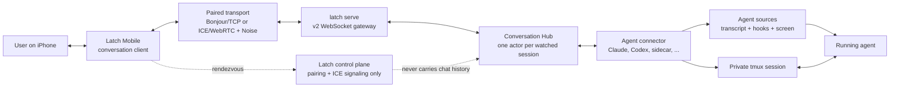
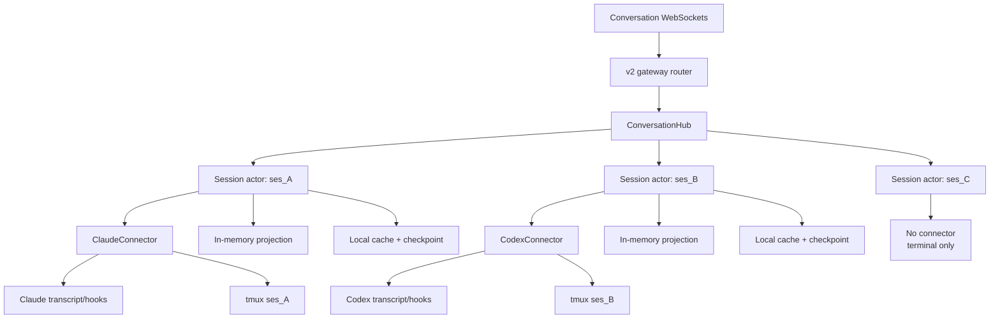
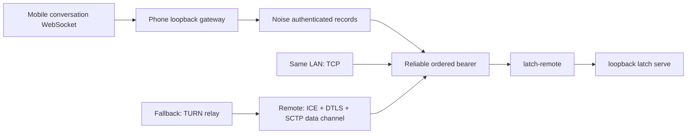
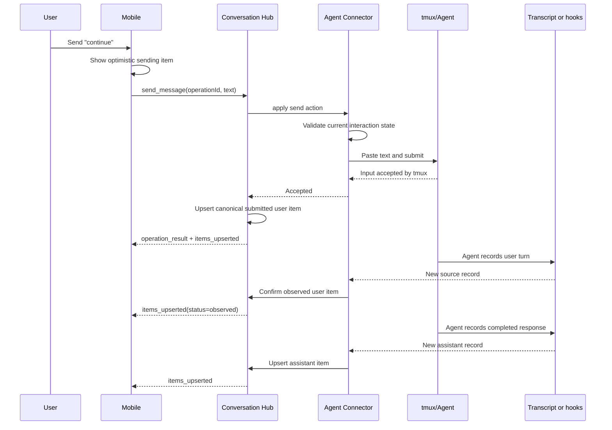

# Latch Conversation Architecture

**Status:** Proposed replacement architecture for review.

**Implementation plan:**
[`CONVERSATION_IMPLEMENTATION_PLAN.md`](./CONVERSATION_IMPLEMENTATION_PLAN.md)

## Purpose

Latch already keeps an interactive agent alive in a private tmux session and can
connect a paired phone to the computer hosting that session. The next product layer is
a chat-quality interface over the same live agent: fast to open, resilient to mobile
disconnects, and independent of any one agent's transcript format.

This document defines that layer from first principles. It deliberately replaces the
current harness-event, events-WebSocket, transcript-reducer, session-capabilities, and
send pipeline. There is no compatibility requirement because Latch has one user and
the desktop app, mobile app, CLI, and packages can move together.

The central decision is:

> The computer hosting the tmux session also hosts a Conversation Hub. One connector
> per watched session converts agent-specific sources and actions into one standard
> conversation model. Clients consume snapshots and stable item updates, not raw
> agent transcripts or low-level harness events.

## Product invariants

1. **The agent session is authoritative.** The conversation is a replaceable
   projection of the agent's real transcript, hooks, and terminal state. It is not a
   second conversation that can continue independently.
2. **The terminal remains the universal fallback.** A session without a connector is
   still a fully usable Latch terminal session. Latch does not fabricate chat
   semantics from arbitrary terminal output.
3. **Agent agnosticism lives at the connector boundary.** The network protocol,
   conversation model, and mobile UI know nothing about Claude, Codex, transcript
   paths, screen glyphs, or hook formats. Connectors contain that knowledge.
4. **New work is proportional to new agent activity.** Appending one source record
   must not re-read or re-normalize an entire transcript.
5. **One source observation feeds every client.** Connecting a second client must not
   start a second transcript parser or duplicate connector work.
6. **Mobile reconnect is normal.** A phone that locks, changes network, or loses its
   socket resumes by revision or receives a fresh snapshot without protocol error
   choreography.
7. **Whole assistant messages are sufficient initially.** The model supports upserts
   so partial text can be added later without a new protocol, but token streaming is
   not required for the first implementation.
8. **No external state service is required.** Live state is owned in-process on the
   session host. Redis, a hosted message broker, and a cloud transcript store are not
   part of this architecture.

## System context



The control plane helps two already-paired devices find a path. It does not receive,
store, order, or relay conversation content. Direct LAN traffic continues to prefer
Bonjour/TCP. ICE/WebRTC and TURN remain reachability mechanisms when a direct LAN path
is unavailable.

## Runtime architecture on the computer

The Conversation Hub runs inside the existing long-lived `latch serve` process. It is
not a new daemon and does not sit between tmux and the agent.



The Hub maintains a map from Latch session ID to a session actor. A session actor owns:

- exactly one connector instance;
- the normalized current conversation;
- a conversation generation and monotonically increasing revision;
- the current agent and interaction state;
- a bounded operation-id ledger for retry-safe user actions;
- subscriber broadcast channels;
- connector source offsets and checkpoints;
- a local normalized cache used for restart and history pagination.

Actors are lazy. Opening a conversation starts its actor; additional subscribers share
it. An actor may remain warm for an idle period after the final subscriber leaves, then
stop its connector task while leaving its local cache intact. The connector catches up
from its checkpoint when the actor starts again.

`latch serve` is the only writer to the new conversation cache. Starting a second
gateway for the same `LATCH_HOME` fails visibly by acquiring an exclusive gateway lock.
This is simpler than coordinating multiple in-process Hubs over a shared cache.

## Transport decision

The application protocol is a long-lived JSON WebSocket. For paired remote access,
that WebSocket rides the transport Latch already has:



WebRTC is therefore transport infrastructure, not the conversation API. Latch does
not introduce a second custom application protocol directly on a data channel. A
single open conversation WebSocket amortizes ICE, DTLS, Noise, and WebSocket setup
over the entire chat session.

The first implementation keeps the current one-bearer-per-loopback-connection model.
If measurements later show connection setup to be material, one paired peer connection
may multiplex logical terminal, conversation, and control channels. That optimization
is explicitly deferred because it is not needed to make message delivery fast.

## Conversation model

Clients render stable conversation items rather than folding a low-level event stream.
Every item has a stable ID, creation time, position, and kind.

```text
ConversationItem
  id              stable within one conversation generation
  ordinal         stable ordering key
  createdAt
  kind
    message       role: user | assistant; text; status
    tool          name; summary; status; optional parent message id
    request       request id; permission | question; prompt; choices; status
```

Initial statuses are intentionally small:

```text
message.status  submitted | observed | complete | failed
tool.status     running | succeeded | failed
request.status  pending | resolved | dismissed
```

Agent lifecycle and action availability are conversation state, not timeline rows:

```text
ConversationState
  phase           starting | idle | working | awaiting_input | exited | unavailable
  sendMessage     enabled + optional reason
  pendingRequest  request id + available choices, or null
  connector       id + version
```

The connector uses native source identifiers whenever possible: transcript record UUID,
tool-use ID, or request ID. When no native identifier exists, it derives a deterministic
ID from the connector epoch and source record identity. Items are upserted by ID.
Concurrent tool calls therefore do not match merely by tool name, and partial assistant
text can later update one existing message.

## Generation and revision

Every conversation snapshot carries two ordering values:

- `generation`: an opaque identity for one derivation of the conversation;
- `revision`: a monotonically increasing integer within that generation.

Appending or updating an item increments the revision. A connector source truncation,
active-branch replacement, incompatible connector change, or unrecoverable cache
mismatch rebuilds the projection and creates a new generation.

Clients reconnect with the last generation and revision they applied:

- if retained mutations cover that revision, the Hub sends only the missing mutations;
- otherwise, the Hub sends a new snapshot immediately;
- a generation mismatch always produces a snapshot;
- stale state is not communicated through a special close code or a forced reconnect.

## WebSocket protocol

The remote gateway becomes protocol major 2. The old v1 event and send surface is
deleted rather than supported in parallel.

```text
WS /v2/sessions/{sessionId}/conversation
```

After authentication and permission checks, the server sends either a recent snapshot
or a resumable mutation batch. The initial snapshot contains the newest 100 items by
default and says whether older history exists.

### Server-to-client messages

```text
snapshot              generation, revision, items, state, hasMoreBefore
items_upserted         generation, revision, items
items_removed          generation, revision, itemIds
state_changed          generation, revision, state
conversation_reset     snapshot payload
operation_result       operationId, accepted, itemId?, reason?
history_page           requestId, items, hasMoreBefore
error                  code, message
```

### Client-to-server messages

```text
resume                 generation?, afterRevision?
send_message           operationId, text
resolve_request        operationId, requestId, choice
history_request        requestId, beforeOrdinal, limit
```

One socket carries snapshots, history requests, live updates, and user actions. This
avoids establishing extra remote connections for ordinary chat interaction. WebSocket
ping/pong provides connection liveness.

The server serializes actions through the session actor. `operationId` is generated by
the client and makes retries idempotent. The actor validates the operation against the
connector's current state immediately before it touches tmux; advertised availability
is user-interface guidance, while the operation result is authoritative.

## Message send and confirmation



The Hub may say that tmux accepted input; it must not claim the agent observed the
message until the connector sees the corresponding source record. Outbound submissions
are matched to observed user records in order, using exact normalized content and a
bounded time window. Direct messages typed on the computer simply arrive as new source
records and receive connector-derived IDs.

## Connector boundary

The connector interface is internal Rust code, not a network or third-party SDK in the
first release. Conceptually it provides:

```text
detect(session metadata)                  -> support result
load(cache/checkpoint)                    -> projection + source position
watch(source position)                    -> item/state mutations
current_actions()                         -> operation-specific availability
apply(send | resolve)                     -> accepted or refused
reconcile(submitted actions, source data) -> confirmed mutations
```

The initial connector is Claude. It reuses proven knowledge from the current parser,
hook capture, transcript discovery, and last-moment tmux screen validation, but emits
stable conversation items rather than `HarnessEvent` records.

The second connector should be Codex. Shipping it is the architectural test that no
Claude assumption escaped into the Hub, protocol, or mobile app.

Latch also defines a future normalized sidecar connector. An integration can append
structured records under the private Latch session directory, allowing an agent to
cooperate without Latch discovering its private transcript layout. Native hooks are
preferred over transcript files, and transcript files are preferred over terminal
screen interpretation.

A generic terminal connector is intentionally absent. Terminal output cannot reliably
identify roles, turns, tool calls, or message boundaries through ANSI redraws, wrapping,
spinners, and alternate screens. Unsupported sessions remain terminal-only.

## Local state and persistence

The hot state is in memory. Each active session actor has an indexed item collection,
current state, recent mutation ring, and subscriber channels. No disk read occurs on a
normal broadcast.

Latch-owned derived state lives under the existing private session directory:

```text
~/.latch/sessions/<session-id>/conversation/
  snapshot.json             compact projection at a known revision
  journal.jsonl             append-only item and state mutations after the snapshot
  connector-checkpoint.json source path, byte offset, stamps, and connector version
```

All three files are disposable caches. The agent transcript and running session remain
authoritative. On startup the actor loads the snapshot and journal once, resumes the
connector from its checkpoint, and processes only appended source bytes. A malformed
or incompatible cache is deleted and rebuilt; there is no cache migration framework.

Journal compaction atomically writes a new snapshot and replaces the journal after a
measured size or mutation threshold. History pages are served from the in-memory index
while an actor is warm. The first implementation may read the compact snapshot once to
serve a cold history request.

SQLite is deferred. It becomes appropriate only if measurements show that cold history
pagination or cache compaction is materially expensive. If needed, embedded SQLite in
WAL mode replaces these files; Redis does not.

## Incremental source consumption

Each connector owns a source checkpoint. For an append-only JSONL transcript, the
checkpoint includes the canonical path, file identity, complete byte offset, and any
in-memory graph needed to resolve the active branch.

On change:

1. stat the source;
2. if identity and length are compatible, read only bytes after the checkpoint;
3. parse complete new records;
4. update connector state and emit only affected item upserts/removals;
5. atomically persist the new checkpoint after journal mutations are durable.

A 100–250 ms stat poll is acceptable initially. Filesystem notifications are an
optimization, not an architectural dependency. A source replacement, truncation, or
active-branch change that invalidates prior items triggers a one-time rebuild and a new
conversation generation.

## Backpressure and bounds

- A slow client never blocks a connector, tmux, or another client.
- Each subscriber has a bounded mutation queue.
- On subscriber overflow, the Hub drops queued mutations and sends a fresh snapshot.
- The in-memory mutation replay ring is bounded by count and bytes.
- Initial snapshots and history pages have hard item and payload limits.
- Connector source reads accept only complete bounded records.
- Tool summaries and other agent-provided structured fields remain bounded before they
  enter the conversation cache.

Chat traffic is small compared with terminal output. Stable whole-item upserts and a
single source parser are more important than binary encoding or token-level transport
optimization.

## Clean replacement boundary

The following current concepts are removed:

- `latch events` and its numeric derived-event cursor;
- `HarnessEvent`, `assistant_delta`, and connector epochs exposed to clients;
- `/v1/sessions/{id}/events`;
- `/v1/sessions/{id}/capabilities` as a separate chat preflight;
- `/v1/sessions/{id}/send`;
- WebSocket close-code resync behavior;
- mobile `EventStream`, `Transcript`, and their cursor folding;
- chat SDK APIs built around the harness-event stream;
- the persisted harness event ledger and its full-transcript reconciliation loop.

There are no adapters, aliases, dual writes, old cursor imports, schema migrations, or
fallback calls to these surfaces. The coordinated release deletes `/v1` remote gateway
routes and ships `/v2`. Existing Latch-owned derived harness-event caches may be
discarded. Agent-owned transcripts are never modified or deleted.

The following infrastructure remains because it is not legacy conversation behavior:

- the private tmux session kernel;
- session metadata and discovery;
- desktop supervision of `latch-remote` and `latch serve`;
- pairing and device identity;
- Noise authentication;
- Bonjour/TCP, ICE/WebRTC, and TURN path selection;
- the terminal WebSocket, moved to the v2 gateway namespace.

## Non-goals for the first implementation

- Token-by-token assistant streaming.
- A hosted transcript store or offline cloud delivery.
- Redis, NATS, Kafka, or another message broker.
- Multiple simultaneous Conversation Hub writers for one Latch home.
- A public third-party connector ABI.
- Semantic chat extraction from arbitrary terminal bytes.
- Cross-computer conversation merging.
- Transport multiplexing over one persistent peer connection.
- Search across every historical conversation.

## Success criteria

The architecture is working when:

1. Opening a long Claude session on mobile produces a recent snapshot without starting
   a child `latch events` process or reparsing unchanged transcript bytes.
2. Two clients watching one session share one connector and receive the same stable
   items.
3. Appending one transcript record performs work bounded by that record and affected
   items, independent of prior transcript length.
4. Reconnecting after backgrounding resumes from revision or receives a snapshot in
   one WebSocket connection.
5. Sending a message appears optimistically, reports authoritative acceptance or
   refusal, and is later confirmed from the agent source without duplication.
6. Permission and question controls update from pushed state and cannot resolve a stale
   request.
7. A slow subscriber cannot stall the connector, agent, terminal, or another client.
8. Sessions without a connector remain fully usable through the terminal and do not
   display a fake chat.
9. Adding the Codex connector requires no changes to the mobile conversation model or
   WebSocket protocol.

