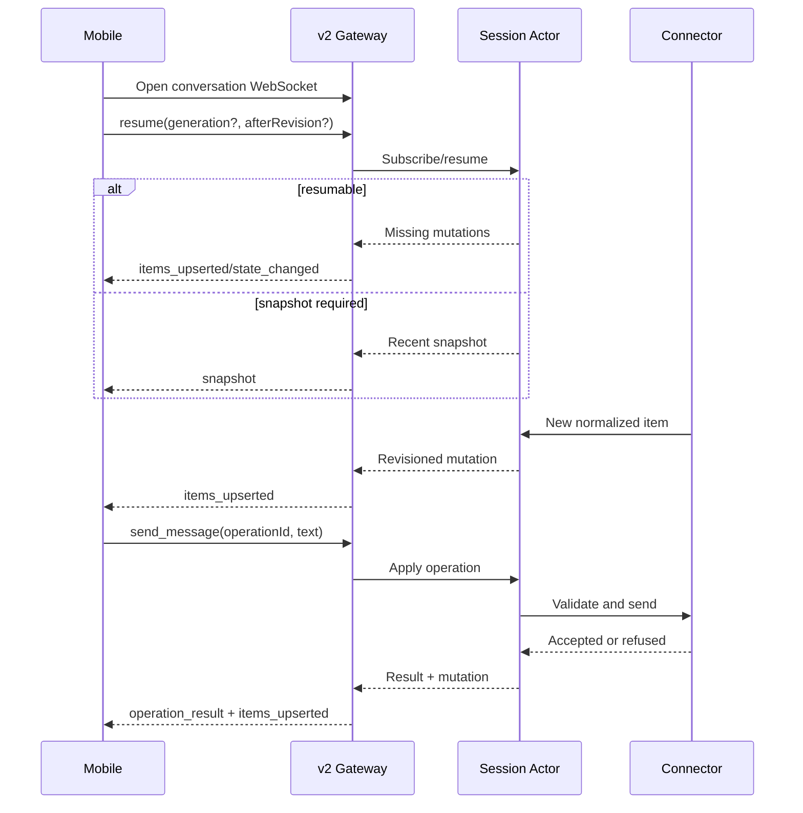

# Conversation Hub Implementation Plan

**Status:** Proposed implementation sequence for review.

**Architecture:**
[`CONVERSATION_ARCHITECTURE.md`](./CONVERSATION_ARCHITECTURE.md) is authoritative for
the product model, ownership boundaries, transport, persistence, protocol semantics,
and clean replacement policy. This document describes how to implement that design in
the current repository.

## Objective

Replace the current Claude-specific harness-event pipeline with a host-local
Conversation Hub that:

- runs inside `latch serve`;
- maintains one normalized conversation per watched Latch session;
- performs incremental agent-source consumption through connectors;
- serves snapshots, history, live upserts, state, and user actions through one v2
  WebSocket;
- gives the native mobile app a fast, resilient chat experience;
- can add Codex without changing the protocol or mobile model.

This is a coordinated breaking change. Implementation does not retain, adapt, migrate,
or test the old chat/events behavior.

## Replacement policy

The implementation follows four rules:

1. **Delete instead of deprecate.** Old event types, endpoints, reducers, reconnect
   paths, schemas, generated types, and tests are removed when their replacement lands.
2. **No dual protocol.** The gateway exposes protocol major 2 only. `/v1` routes do not
   coexist with `/v2` routes.
3. **No cache migration.** Old Latch-owned harness event ledgers and client cursors are
   discarded. The new projection rebuilds from the authoritative agent source.
4. **Do not delete agent data.** Claude, Codex, or other agent-owned transcripts are
   read-only inputs and are never modified during cleanup.

The terminal kernel, remote-access pairing, Noise, Bonjour/TCP, ICE, TURN, and desktop
supervision remain in place. They are prerequisites, not compatibility shims.

## Target repository shape

Names may change during implementation, but ownership should converge on this shape:

```text
crates/latch/src/
  conversation/
    mod.rs                 public internal domain surface
    model.rs               items, state, snapshot, mutation, IDs
    hub.rs                 session actor registry and lifecycle
    actor.rs               one serialized conversation state machine
    cache.rs               snapshot, journal, checkpoint, compaction
    protocol.rs            v2 WebSocket client/server messages
    connector.rs           connector traits and detection
    connectors/
      claude.rs            Claude observation and actions
      codex.rs             second connector
      sidecar.rs           reserved normalized-source connector
  cli/serve/
    conversation.rs        WebSocket authorization and relay into Hub
    terminal.rs            terminal endpoint under v2
    http.rs                v2 discovery and routing

apps/LatchMobile/Sources/LatchMobileKit/
  ConversationClient.swift
  ConversationModel.swift
  ConversationStore.swift
  ConversationSocket.swift

apps/LatchMobile/App/LatchMobile/
  ChatView.swift
  ConversationRows.swift
  ConversationComposer.swift

apps/LatchMobile/Contract/schemas/
  conversation-item.v2.json
  conversation-state.v2.json
  conversation-protocol.v2.json
  gateway-capabilities.v2.json
```

Existing locations can be used where doing so keeps module boundaries cleaner. The
important rule is that connector-specific code must not appear in the Hub, gateway
protocol, or mobile client.

## Delivery graph

```mermaid
flowchart LR
    P0["0. Contract + demolition"]
    P1["1. Domain + connector boundary"]
    P2["2. Incremental Claude connector"]
    P3["3. Hub + cache"]
    P4["4. v2 conversation WebSocket"]
    P5["5. Native mobile replacement"]
    P6["6. Package cleanup/replacement"]
    P7["7. Codex connector"]
    P8["8. Performance + release proof"]

    P0 --> P1 --> P2 --> P3 --> P4 --> P5 --> P6 --> P7 --> P8
```



The sequence is intentionally vertical. Until the Hub and v2 protocol are stable,
parallel client work would encode unsettled semantics and create throwaway adapters.

## Phase 0 — Contract and demolition boundary

### Goal

Write the new contract first and make the breaking release boundary impossible to
misunderstand.

### Work

1. Define canonical JSON schemas for:
   - conversation items and stable IDs;
   - conversation state and operation-specific availability;
   - snapshots, upsert/remove mutations, resets, history pages, operations, results,
     and errors;
   - protocol-major-2 gateway discovery.
2. Set the gateway protocol major to 2.
3. Replace the `/v1` router definition with the intended `/v2` surface:
   - `GET /v2/capabilities`;
   - `GET /v2/sessions`;
   - `GET /v2/sessions/{id}`;
   - `WS /v2/sessions/{id}/terminal`;
   - `WS /v2/sessions/{id}/conversation`.
4. Delete the old chat-facing schemas and generated contract types:
   - `harness-event.v1`;
   - `interaction-capabilities.v1`;
   - old send request/response types;
   - event-stream close-code constants.
5. Delete tests whose only purpose is compatibility with `/v1`, numeric event cursors,
   or harness-event reducers.
6. Update contract generators so Rust and Swift are generated from the new canonical
   schemas. TypeScript generation is retained only if the package replacement in Phase
   6 will use it.

The repository may not build in the middle of this phase. The phase ends only when the
new empty/skeletal v2 surface builds and no legacy chat symbol remains.

### Exit criteria

- Searching for `HarnessEvent`, `assistant_delta`, `/v1/sessions`, `EventStreamClose`,
  and the old interaction-capability schema returns no production references.
- Gateway discovery reports protocol major 2 and only v2 endpoints.
- The terminal endpoint still works through its v2 path.
- No compatibility aliases or conditional old-client branches exist.

## Phase 1 — Conversation domain and connector boundary

### Goal

Create a stable agent-neutral model before porting Claude behavior.

### Work

1. Implement domain types:
   - `ConversationId` or session-scoped identity;
   - `GenerationId`;
   - `Revision`;
   - stable `ConversationItemId` and `Ordinal`;
   - message, tool, and request variants;
   - `ConversationState`;
   - item upsert/remove and state mutations.
2. Implement a pure projection reducer:
   - apply mutations in revision order;
   - reject gaps or cross-generation mutations;
   - produce bounded recent snapshots;
   - page by ordinal;
   - make repeat application of the same revision idempotent.
3. Define the internal connector traits for detection, loading, watching, action
   availability, applying actions, and reconciling submitted messages.
4. Define connector outputs only in conversation-domain terms. No connector may emit
   wire messages directly.
5. Add deterministic ID helpers that prefer source-native IDs and otherwise derive IDs
   from connector identity plus source record identity.
6. Add fixture-driven tests for:
   - stable ordering;
   - concurrent tools with identical names;
   - explicit request lifecycle;
   - assistant upsert behavior;
   - generation reset;
   - duplicate mutation handling.

### Exit criteria

- Domain and reducer tests require no Claude-specific imports.
- Tool completion is matched by stable ID, never by the most recent tool name.
- A request remains pending until an explicit resolved or dismissed mutation.
- Replacing a complete assistant item with a later upsert does not append a duplicate.

## Phase 2 — Incremental Claude connector

### Goal

Replace the current full-transcript reconciliation loop with one stateful Claude
connector that processes only new source data during steady state.

### Work

1. Move reusable Claude knowledge behind `connectors/claude`:
   - launch metadata detection;
   - transcript discovery;
   - transcript record parsing;
   - hook capture and permission derivation;
   - safe tool summaries;
   - tmux screen validation for send and resolve.
2. Remove the standalone `latch events` command and the child-process relay in the
   gateway.
3. Implement a source checkpoint containing:
   - canonical transcript path and file identity;
   - complete byte offset;
   - hook-sidecar byte offset;
   - active-record graph state required for branch selection;
   - connector implementation version.
4. On normal append, read and parse only records after the offsets.
5. Detect file replacement, truncation, incompatible checkpoint, and active-branch
   invalidation. Rebuild once and return a new conversation generation.
6. Emit whole completed assistant messages for the first release. Do not emit token
   deltas.
7. Preserve native tool-use and request IDs. Derive deterministic message IDs from
   transcript UUIDs and content-block identity.
8. Implement action handling:
   - query current operation-specific availability;
   - capture and validate the screen immediately before action;
   - paste and submit a message;
   - resolve the exact visible request and choice;
   - return structured acceptance or refusal.
9. Reconcile Hub-submitted user messages with observed Claude user records using a
   FIFO of outstanding operations, exact normalized text, and a bounded time window.
10. Retain and extend raw Claude fixtures. Delete fixtures that assert the old
    `HarnessEvent` wire representation; assert conversation items and state instead.

### Performance tests

- Build a transcript with at least 100,000 source records.
- Load once, append one record, and assert the connector reads only the appended range.
- Assert steady-state append time does not scale with the preexisting transcript size.
- Assert two watchers do not instantiate two connectors once the Hub exists.

### Exit criteria

- No production path reparses a complete unchanged Claude transcript on each append.
- The Claude connector produces stable messages, tools, requests, and state from the
  fixture corpus.
- Send and resolve remain authoritative at the last-moment screen check.
- Source branch replacement produces a new generation, not a corrupted incremental
  timeline.

## Phase 3 — Conversation Hub and local cache

### Goal

Create one shared, bounded, restartable session actor per watched conversation.

### Work

1. Implement `ConversationHub` as a map from session ID to actor handle.
2. Acquire an exclusive Hub/gateway lock for the Latch home. A second writer fails with
   a clear diagnostic.
3. Implement actor lifecycle:
   - lazy connector detection and startup;
   - subscriber reference counting;
   - configurable warm idle period;
   - connector stop and checkpoint on eviction;
   - catch-up on reactivation.
4. Serialize all source mutations and user actions through the actor mailbox.
5. Maintain:
   - indexed current items;
   - current state;
   - generation and revision;
   - bounded recent-mutation ring;
   - bounded idempotent operation results;
   - bounded subscriber queues.
6. Implement overflow behavior: discard that subscriber's queued mutations and enqueue
   a replacement snapshot. Never block the connector actor on a client.
7. Implement the per-session cache described in the architecture:
   - atomically written compact snapshot;
   - append-only JSONL mutations;
   - atomically written connector checkpoint;
   - threshold-based compaction;
   - strict record and file bounds.
8. On malformed or incompatible cache, delete only the Latch-owned conversation cache
   and rebuild from the connector source.
9. Treat sessions without a connector as `unavailable` for conversation while leaving
   terminal operations unaffected.

### Concurrency tests

- Ten subscribers to one session produce one connector instance.
- A deliberately stalled subscriber overflows and resynchronizes without delaying a
  healthy subscriber.
- Concurrent send operations are serialized and operation IDs deduplicate retries.
- Actor eviction and immediate reactivation resume from the durable checkpoint.
- Gateway restart loads the cache once and catches up only missing source records.

### Exit criteria

- One source observation is shared by all subscribers.
- No client can block the agent, connector, or another client.
- A warm reconnect can resume by revision without touching the source transcript.
- A cold restart reconstructs the same projection and revision sequence or deliberately
  starts a new generation.

## Phase 4 — Protocol-major-2 conversation WebSocket

### Goal

Expose the Hub through one authenticated, resumable, bidirectional WebSocket.

### Work

1. Implement `WS /v2/sessions/{id}/conversation`.
2. Reuse the current paired transport, Noise authentication, gateway credential
   injection, and permission grant. Map permissions cleanly:
   - observe: snapshot, resume, live updates, and history;
   - interact: send message and resolve request;
   - control: terminal input through the terminal endpoint.
3. Require the first client message to be `resume`, even for a fresh client. This keeps
   initialization deterministic and permits future negotiated limits.
4. Send either:
   - missing mutations when generation/revision can resume; or
   - a recent snapshot when they cannot.
5. Implement bidirectional operations and correlated results on the same socket.
6. Implement bounded `history_request` and `history_page` messages.
7. Validate all payload sizes before sending them to the Hub.
8. Translate subscriber overflow into a snapshot on the same socket.
9. Use normal protocol errors for malformed messages and permission refusals. Do not
   recreate custom close-code cursor recovery.
10. Add end-to-end tests over a real local WebSocket plus focused tests through the
    Noise tunnel.

### Protocol sequence



### Exit criteria

- A fresh connection receives a recent snapshot through one WebSocket.
- A reconnect resumes from revision when possible without replaying the full history.
- A stale generation receives a snapshot without closing and reconnecting.
- History and actions require no extra HTTP or WebRTC connection.
- The v1 gateway surface no longer exists.

## Phase 5 — Native mobile replacement

### Goal

Replace the current event-folding chat screen with a persistent conversation store
that renders Hub-owned items and state.

### Work

1. Delete native `EventStream`, `Transcript`, the old `ChatModel`, and their tests.
2. Implement `ConversationSocket`:
   - connect through the current `LatchGateway` transport;
   - send `resume` from stored generation/revision;
   - reconnect with bounded backoff;
   - apply snapshots and revisioned mutations;
   - issue correlated history and action requests.
3. Implement `ConversationStore` keyed by session ID:
   - persist recent items, generation, revision, and state locally;
   - keep stores alive across navigation;
   - restore immediately before network connection;
   - replace local state atomically on server snapshot;
   - bound stored history by count and bytes.
4. Implement optimistic outbound messages:
   - create an operation ID and local sending row immediately;
   - merge the canonical Hub item by operation/item ID;
   - display authoritative refusal and retain text for retry;
   - never duplicate the later observed user record.
5. Drive composer and request controls exclusively from pushed conversation state.
   There is no separate capabilities fetch for chat interaction.
6. Load the newest page initially and request older pages when the user scrolls near the
   top.
7. Preserve scroll position when older items prepend or existing items upsert.
8. Coalesce rapid item upserts into bounded main-actor UI updates so future partial
   assistant streaming does not require a UI rewrite.
9. Keep the terminal fallback visible for unsupported connectors and advanced recovery.

### UI tests

- Restored cached messages render before the remote connection completes.
- Snapshot replacement does not duplicate rows or leave stale request controls.
- Navigating away and back does not replay from the beginning.
- Background/foreground reconnect resumes or snapshots correctly.
- A send appears immediately, then becomes submitted/observed or failed.
- Incoming permission state enables the correct choices without a capability refresh.
- History prepend keeps the currently visible item anchored.

### Exit criteria

- Opening an existing chat feels immediate from local cache or a bounded server
  snapshot.
- New whole assistant messages appear without transcript replay.
- User actions and permission controls track pushed server state.
- No native type references the old harness-event contract.

## Phase 6 — Package cleanup and replacement

### Goal

Remove the old SDK surface so the repository has one conversation model even before a
new public SDK is distributed.

### Work

1. Delete the event subscription, numeric cursor, and harness-event exports from
   `@latch/client`.
2. Delete `@latch/chat-react` if no current application consumes it. Do not preserve an
   obsolete package merely to keep its name buildable.
3. If the React example remains valuable, rebuild it directly on the v2 conversation
   protocol after the native mobile implementation proves the model.
4. Remove `@latch/harness-schema`; replace it with generated v2 conversation types only
   if a TypeScript consumer exists now.
5. Delete old package fixtures, persistence envelopes, reconnect tests, and docs.
6. Update repository planning and README references so they do not claim the events SDK
   remains supported.

### Exit criteria

- There is one conversation schema and one set of semantics in the repository.
- No package exposes old event, cursor, capability-preflight, or send APIs.
- Workspace build and boundary checks contain no orphaned compatibility package.

## Phase 7 — Codex connector

### Goal

Prove agent agnosticism with a second real connector before declaring the boundary
stable.

### Work

1. Collect Codex fixtures for:
   - user and assistant turns;
   - tool start/completion and failure;
   - permission and question requests;
   - session start, idle, working, and exit;
   - branching or transcript rewrite behavior;
   - directly typed terminal messages.
2. Implement Codex detection, transcript/hook discovery, checkpointing, normalization,
   and action application entirely behind the connector trait.
3. Use native source IDs where present and document deterministic fallbacks where they
   are not.
4. Run the same connector conformance suite used for Claude.
5. Verify that no protocol, Hub, or mobile source file changes are necessary beyond
   displaying the connector name or additive item details.

### Exit criteria

- Claude and Codex sessions produce the same conversation domain semantics.
- Mobile can switch between them without connector-specific conditionals.
- Adding Codex requires no WebSocket protocol change.
- Any connector-trait change made during this phase is folded back into the Claude
  implementation and conformance suite before completion.

## Phase 8 — Performance, failure, and release proof

### Goal

Demonstrate that the replacement is both simpler operationally and bounded under long
sessions, multiple clients, and poor networks.

### Measurements

Instrument and record:

- cold actor startup by transcript size;
- warm snapshot latency;
- one-record append CPU time and bytes read;
- message acceptance latency from phone to tmux;
- transcript-observation latency from source append to mobile item;
- memory per warm actor and per subscriber;
- snapshot and mutation payload sizes;
- reconnect time on LAN, direct ICE, and TURN;
- cache compaction duration;
- stalled-subscriber recovery time.

### Failure tests

- Kill and restart `latch serve` during an active conversation.
- Truncate or replace a connector source.
- Corrupt each Latch-owned cache file independently.
- Background the phone during send and retry the same operation ID.
- Disconnect after tmux accepts input but before mobile receives the result.
- Overflow one subscriber while another remains healthy.
- Exit and remove a tmux session while clients are connected.
- Change remote path between LAN, direct ICE, and TURN.

### Required performance properties

These are asymptotic requirements rather than hardware-specific promises:

- steady-state source append is `O(new source data + affected items)`;
- broadcast is `O(number of healthy subscribers)`;
- reconnect is `O(missing retained mutations)` or `O(snapshot page size)`;
- history request is `O(page size)` after the actor's index is loaded;
- a slow subscriber has bounded memory and zero effect on connector progress;
- no normal operation launches a child transcript-streaming process.

### Coordinated release checklist

1. Ship matching CLI, desktop, remote helper, and mobile builds.
2. Bump gateway protocol discovery to major 2.
3. Remove `/v1`, old schemas, old generated types, and old SDK packages in the same
   release.
4. Discard old Latch-owned chat caches on first v2 startup.
5. Preserve all agent-owned transcripts and session metadata.
6. Verify terminal attach and remote pairing independently of conversation support.
7. Verify Claude and Codex connector conformance fixtures.
8. Run Rust, Swift, contract-generation, boundary, and remote end-to-end suites.

## Definition of done

The replacement is complete when:

- one connector instance incrementally observes each watched session;
- the Hub owns a stable conversation projection and pushed interaction state;
- one v2 WebSocket handles snapshot, resume, history, updates, send, and resolve;
- mobile opens from bounded cached state and never rebuilds an entire transcript;
- Claude and Codex both conform to the same connector contract;
- no legacy event endpoint, cursor, schema, reducer, package API, compatibility shim,
  cache migration, or dual write remains;
- terminal, pairing, and remote transport still function as independent fallback
  infrastructure;
- performance tests demonstrate bounded work and stalled-client isolation.

