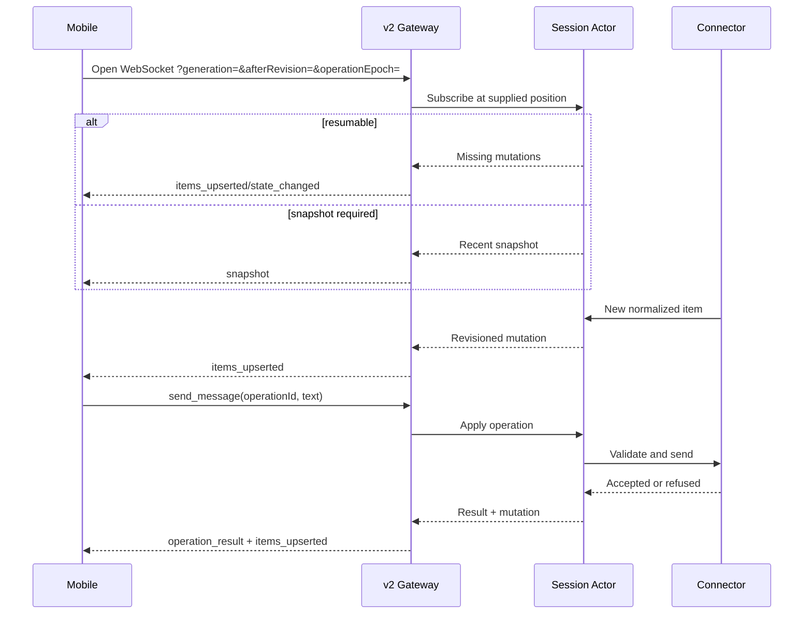

# Conversation Hub Implementation Plan

**Status:** Proposed implementation sequence for review.

**Architecture:**
[`CONVERSATION_ARCHITECTURE.md`](./CONVERSATION_ARCHITECTURE.md) is authoritative for
the product model, ownership boundaries, transport, persistence, protocol semantics,
and clean replacement policy. This document describes how to implement that design in
the current repository.

**Revision 2.** Amended after
[`CONVERSATION_ARCHITECTURE_REVIEW.md`](./CONVERSATION_ARCHITECTURE_REVIEW.md).
It introduced the grant boundary, Hub-owned ordering, incremental rewind handling,
bounded backpressure, and explicit live-state cost. Changes from that review remain
marked **[R2]** where useful.

**Revision 3.** The release is now an unconditional clean break: there is no v1
discovery tombstone, staged compatibility build, or legacy CLI adapter. Operation
durability and connector branch-index persistence are specified without relying on
false exactly-once or fixed-size-checkpoint assumptions.

## Objective

Replace the current Claude-specific harness-event pipeline with a host-local
Conversation Hub that:

- runs inside `latch serve`;
- maintains one normalized conversation per watched Latch session;
- performs incremental agent-source consumption through connectors;
- serves snapshots, history, live upserts, state, and user actions through one v2
  WebSocket;
- gives the native mobile app a fast, resilient chat experience;
- can add Codex without changing the protocol or mobile model.

This is a coordinated breaking change. Implementation does not retain, adapt, migrate,
or test the old chat/events behavior.

## Replacement policy

The implementation follows four rules:

1. **Delete instead of deprecate.** Old event types, endpoints, reducers, reconnect
   paths, schemas, generated types, and tests are removed when their replacement lands.
2. **No dual protocol.** The gateway exposes protocol major 2 only. No `/v1` route,
   including a discovery tombstone, coexists with `/v2`. Temporary mixed-major
   failure during the single-user update is accepted.
3. **No cache migration.** Old Latch-owned harness event ledgers and client cursors are
   discarded. The new projection rebuilds from the authoritative agent source.
4. **Do not delete agent data.** Claude, Codex, or other agent-owned transcripts are
   read-only inputs and are never modified during cleanup.

The terminal kernel, remote-access pairing, Noise, Bonjour/TCP, ICE, TURN, and desktop
supervision remain in place. They are prerequisites, not compatibility shims.

## Target repository shape

Names may change during implementation, but ownership should converge on this shape:

```text
crates/latch/src/
  conversation/
    mod.rs                 public internal domain surface
    model.rs               items, state, snapshot, mutation, IDs
    hub.rs                 session actor registry and lifecycle
    actor.rs               one serialized conversation state machine
    cache.rs               snapshot, journal, checkpoint, compaction
    protocol.rs            v2 WebSocket client/server messages
    connector.rs           connector traits and detection
    connectors/
      claude.rs            Claude observation and actions
      codex.rs             second connector
      sidecar.rs           reserved normalized-source connector
  cli/serve/
    conversation.rs        WebSocket authorization and relay into Hub
    terminal.rs            terminal endpoint under v2
    http.rs                v2 discovery and routing
    routes.rs              [R2] one route + required-grant table
  cli/
    remote_access.rs       [R2] consumes routes.rs; injects the grant

apps/LatchMobile/Sources/LatchMobileKit/
  ConversationClient.swift
  ConversationModel.swift
  ConversationStore.swift
  ConversationSocket.swift

apps/LatchMobile/App/LatchMobile/
  ChatView.swift
  ConversationRows.swift
  ConversationComposer.swift

apps/LatchMobile/Contract/schemas/
  conversation-item.v2.json
  conversation-state.v2.json
  conversation-protocol.v2.json
  gateway-capabilities.v2.json
```

Existing locations can be used where doing so keeps module boundaries cleaner. The
important rule is that connector-specific code must not appear in the Hub, gateway
protocol, or mobile client.

## Delivery graph

```mermaid
flowchart LR
    P0["0. Contract + demolition"]
    P1["1. Domain + connector boundary"]
    P2["2. Incremental Claude connector"]
    P3["3. Hub + cache"]
    P4["4. v2 conversation WebSocket"]
    P5["5. Native mobile replacement"]
    P6["6. Package cleanup/replacement"]
    P7["7. Codex connector"]
    P8["8. Performance + release proof"]

    P0 --> P1 --> P2 --> P3 --> P4 --> P5 --> P6 --> P7 --> P8
```



The sequence is intentionally vertical. Until the Hub and v2 protocol are stable,
parallel client work would encode unsettled semantics and create throwaway adapters.

## Phase 0 — Contract and demolition boundary

### Goal

Write the new contract first and make the breaking release boundary impossible to
misunderstand.

### Work

1. Define canonical JSON schemas for:
   - conversation items and stable IDs. **[R2]** `ordinal` is documented as
     observation order assigned by the Hub, and `createdAt` as display metadata;
     clients sort by `ordinal`;
   - conversation state and operation-specific availability. **[R2]**
     `pendingRequest` is documented as derived from item status;
   - snapshots, upsert/remove mutations, history pages, operations, results,
     and errors. **[R2]** No `conversation_reset`: `snapshot` gains an optional
     `reason` (`initial` | `generation` | `operation_epoch` | `overflow`) instead;
     `operation_result.status` is `accepted | refused | ambiguous`;
     snapshots and action messages carry a per-conversation `operationEpoch`;
   - **[R2]** `partial` reserved in `message.status`, emitted by nothing, with a
     documented client rule to render an unknown status as `complete`;
   - protocol-major-2 gateway discovery, **[R2]** retaining `gatewayInstanceId` and
     advertising `operationRetentionSeconds`.
2. Set the gateway protocol major to 2.
3. **[R2]** Define the route table once, in `cli/serve/routes.rs`, as route plus
   required grant. The router and the remote-access allowlist both consume it.
   Today `permission_for_request` in `remote_access.rs` is a hand-maintained
   second copy, which is how a `/v2` router would ship with every paired request
   broken.
   - `GET /v2/capabilities` — observe;
   - `GET /v2/sessions` — observe;
   - `GET /v2/sessions/{id}` — observe;
   - `WS /v2/sessions/{id}/terminal` — control, or observe with `mode=read-only`;
   - `WS /v2/sessions/{id}/conversation` — observe to open.
4. **[R2]** Carry the device grant to the gateway. `authorize_and_inject` already
   rewrites headers and already rejects a client-supplied `Authorization`; it
   states the grant on the same rewrite, and `serve` rejects the header from any
   source other than the loopback proxy. A direct loopback client (CLI, desktop)
   defaults to control. Without this the conversation socket is a hole in the
   grant model: the proxy authorizes one upgrade and never sees the operations
   that follow.
5. Delete the old chat-facing schemas and generated contract types:
   - `harness-event.v1`;
   - `interaction-capabilities.v1`;
   - old send request/response types;
   - event-stream close-code constants.
6. Delete tests whose only purpose is compatibility with `/v1`, numeric event cursors,
   or harness-event reducers.
7. Update contract generators so Rust and Swift are generated from the new canonical
   schemas. TypeScript generation is retained only if the package replacement in Phase
   6 will use it.

The repository may not build in the middle of this phase. The phase ends only when the
new empty/skeletal v2 surface builds and no legacy chat symbol remains.

### Exit criteria

- Searching for `HarnessEvent`, `assistant_delta`, `/v1`, `EventStreamClose`,
  and the old interaction-capability schema returns no production references.
- Gateway discovery reports protocol major 2 and only v2 endpoints.
- **[R2]** The terminal endpoint still works through its v2 path **through the
  Noise tunnel**, not only on loopback. A loopback-only check cannot see the
  remote allowlist, which is exactly where this breaks.
  `RemoteAccessEndToEndTests` already has the harness for it.
- **[R2]** Every route the router serves appears in the shared table, enforced by
  a test, so a later endpoint cannot be silently unroutable when paired.
- No compatibility aliases or conditional old-client branches exist.

## Phase 1 — Conversation domain and connector boundary

### Goal

Create a stable agent-neutral model before porting Claude behavior.

### Work

1. Implement domain types:
   - `ConversationId` or session-scoped identity;
   - `GenerationId`;
   - `Revision`;
   - stable `ConversationItemId` and `Ordinal`. **[R2]** `Ordinal` is
     constructible only by the Hub — make that a type-level property, not a
     convention, so a connector cannot mint one;
   - message, tool, and request variants;
   - `ConversationState`;
   - the mutation vocabulary: `Upsert`, **[R2]** `TruncateAfter`, `State`,
     `Rebuild`.
2. Implement a pure projection reducer:
   - apply mutations in revision order;
   - reject gaps or cross-generation mutations;
   - produce bounded recent snapshots;
   - page by ordinal;
   - make repeat application of the same revision idempotent.
3. **[R2]** Define the connector trait in the revised form the architecture
   fixes:
   - `detect` returns `Unsupported | Pending { reason } | Supported`, so a
     connector that has not yet observed its binding is distinguishable from one
     that will never work;
   - `poll(budget)` covers source reads *and* live state on one cadence, and is
     the only place a connector may perform observation I/O;
   - `actions()` returns descriptors carrying `requiredGrant`, so the Hub gates
     operations without knowing what they mean;
   - `apply` is the only place a connector may perform action I/O or mutate the
     agent;
   - `poll` returns its offset and active-branch deltas with its domain mutations;
     `checkpointSnapshot()` serializes full connector state only for periodic
     compaction, never after every source append.
4. Define connector outputs only in conversation-domain terms. No connector may emit
   wire messages directly. **[R2]** No connector may emit an ordinal, a revision,
   or a generation either — the Hub stamps all three.
5. Add deterministic ID helpers that prefer source-native IDs and otherwise derive IDs
   from connector identity plus source record identity.
6. **[R2]** Derive `ConversationState.pendingRequest` in the reducer from the
   newest `pending` request item. It is never set independently.
7. Add fixture-driven tests for:
   - stable ordering;
   - **[R2]** an item whose `createdAt` precedes the previous item's — it must
     not move, which is the transcript/hook-sidecar merge in miniature;
   - concurrent tools with identical names;
   - explicit request lifecycle;
   - assistant upsert behavior;
   - **[R2]** `TruncateAfter` dropping the tail without a generation change;
   - generation reset;
   - duplicate mutation handling.
8. Collect Claude and Codex source fixtures now, before the connector trait hardens:
   turns, tools, permissions/questions, lifecycle state, branching, rewrites, and
   directly typed terminal input.

### Exit criteria

- Domain and reducer tests require no Claude-specific imports.
- Tool completion is matched by stable ID, never by the most recent tool name.
- A request remains pending until the connector emits an explicit resolved or
  dismissed mutation. **[R2]** This is a statement about the *Hub*: it may not
  invent a resolution. It is not a claim that some source emits one — none does,
  and Phase 2 defines the connector-side rule that produces it.
- **[R2]** No test can construct an `Ordinal` outside the Hub.
- Replacing a complete assistant item with a later upsert does not append a duplicate.

## Phase 2 — Incremental Claude connector

### Goal

Replace the current full-transcript reconciliation loop with one stateful Claude
connector that processes only new source data during steady state.

### Work

1. Move reusable Claude knowledge behind `connectors/claude`:
   - launch metadata detection;
   - transcript record parsing;
   - hook capture and permission derivation;
   - safe tool summaries;
   - tmux screen validation for send and resolve.
2. **[R2] Replace transcript discovery; do not port it.** The current fallback
   picks the newest `.jsonl` in the encoded project directory, so two Latch
   sessions in one working directory resolve to the same file and the winner
   changes with every write. Under a checkpointed connector that is not a display
   bug — it is a rebuild/new-generation/full-snapshot loop.
   - Register a `SessionStart` hook alongside the existing `PermissionRequest`
     one; the payload already carries `session_id` and `transcript_path`.
   - Pin both on first observation and store them in the checkpoint.
   - Return `Pending` until observed, which the Hub reports as `phase: starting`.
   - Delete `newest_jsonl`.
3. Remove the standalone `latch events` command and the child-process relay in the
   gateway. There is no compatibility successor in this milestone.
4. Implement a source checkpoint containing:
   - the observed binding (agent session id and source path) and file identity;
   - complete byte offset per source, transcript and hook sidecar;
   - **[R2]** an active-branch index. It may grow with the active source chain, so
     persist it as append-only branch deltas and compact it into the periodic
     snapshot; never rewrite the full index after every source append;
   - connector implementation version.
5. On normal append, read and parse only records after the offsets.
6. **[R2]** Classify each appended record against the active chain rather than
   rebuilding: parent is the chain tail → `Upsert`; parent is an earlier active id →
   `TruncateAfter` then `Upsert`; a recognized side-branch or subagent record does not
   move the main-chain tail; an unknown, unclassifiable parent → `Rebuild`. Interrupts
   and rewinds are routine, and today they hard-fail the stream; making them full
   rebuilds would make full snapshots part of ordinary use.
7. Detect file replacement, truncation, and an incompatible checkpoint. Rebuild
   once and return a new conversation generation.
8. **[R2]** Skip and count malformed records instead of failing the parse. A
   short-lived subscriber could afford to die on a bad line; a long-lived
   connector would wedge the session until someone deleted the file. Surface the
   count in connector state.
9. Emit whole completed assistant messages for the first release. Do not emit token
   deltas.
10. Preserve native tool-use and request IDs. Derive deterministic message IDs from
    transcript UUIDs and content-block identity. **[R2]** Include `prompt_id` in
    permission-request id derivation: live Claude records carry it and carry none
    of `request_id`, `requestId`, `tool_use_id`, or `uuid`, so today they fall to
    a `permission:<tool>:<timestamp>` fallback and two `Bash` permissions in one
    second collide. Under upsert-by-id a collision merges two requests into one
    item and leaves one of them unanswerable. Give the fallback a per-source
    sequence rather than a timestamp.
11. **[R2]** Define the request lifecycle rule, and make it a connector conformance
    rule rather than a Claude UI detail. No Claude source emits "resolved": the
    transcript has no resolution record and there is no `PermissionResolved` hook.
    - `resolved` means Latch successfully applied a resolution to that exact request;
    - `dismissed` means the authoritative main conversation advanced beyond the
      request, or a screen refresh showed the prompt gone without a known Latch
      resolution;
    - unrelated hook, side-branch, and subagent records do not close the request.
    Conformance rule for every connector, Codex included: a request cannot remain
    `pending` after authoritative main-chain progress or confirmed prompt absence.
12. Implement action handling:
    - `actions()` returns descriptors with `requiredGrant`;
    - capture and validate the screen immediately before action;
    - paste and submit a message;
    - resolve the exact visible request and choice;
    - return structured acceptance or refusal.
13. **[R2]** Make live-state capture cheap enough to schedule. Screen capture is a
    subprocess; hash the result so an unchanged screen emits no mutation and burns
    no revision, capture at most once per `poll`, and treat a capture failure as
    `unavailable` with a reason rather than an error that kills the connector.
14. Reconcile Hub-submitted user messages with observed Claude user records using a
    FIFO of outstanding operations, exact normalized text, and a bounded time window.
15. Retain and extend raw Claude fixtures. Delete fixtures that assert the old
    `HarnessEvent` wire representation; assert conversation items and state instead.

### Performance tests

- Build a transcript with at least 100,000 source records.
- Load once, append one record, and assert the connector reads only the appended range.
- Assert steady-state append time does not scale with the preexisting transcript size.
- Assert checkpoint/journal bytes written for a normal append are `O(new branch
  mutations)`, independent of active-chain and transcript length. Separately measure
  periodic compaction as `O(active branch)`.
- **[R2]** Append a record parented to an earlier on-chain id; assert one
  `TruncateAfter` and no generation change.
- **[R2]** Run two sessions in one working directory; assert each observes its own
  transcript and neither changes generation.
- Assert two watchers do not instantiate two connectors once the Hub exists.

### Exit criteria

- No production path reparses a complete unchanged Claude transcript on each append.
- The Claude connector produces stable messages, tools, requests, and state from the
  fixture corpus.
- Send and resolve remain authoritative at the last-moment screen check.
- Source branch replacement produces a new generation, not a corrupted incremental
  timeline. **[R2]** A rewind onto the existing branch produces a truncation, not a
  new generation.
- **[R2]** No production path resolves a transcript by modification time.
- **[R2]** A request answered at the computer stops being `pending` within one
  idle heartbeat.

## Phase 3 — Conversation Hub and local cache

### Goal

Create one shared, bounded, restartable session actor per watched conversation.

### Work

1. Implement `ConversationHub` as a map from session ID to actor handle.
2. Acquire an exclusive Hub/gateway lock for the Latch home. A second writer fails with
   a clear diagnostic. **[R2]** Acquire with a bounded retry — roughly 2 s at 50 ms —
   before failing. The desktop supervises `latch serve`, and a restart that races
   the dying process's exit must not surface as an error in exactly the situation
   the supervisor exists to handle.
3. Implement actor lifecycle:
   - lazy connector detection and startup;
   - subscriber reference counting;
   - configurable warm idle period;
   - connector stop and checkpoint on eviction;
   - catch-up on reactivation.
4. **[R2]** Separate the state actor from both kinds of blocking I/O. The actor
   schedules at most one observation poll per session and one serialized action per
   session on bounded workers, each with a deadline; immutable results return as
   mailbox messages. Only the actor mutates the projection or advances revisions.
   One `send` is several blocking `tmux` invocations, and screen polling also spawns a
   process; neither may stop fanout. Enforce child-process kill deadlines. A timeout
   during read-only preflight is `refused`; after the first mutating step it is
   `ambiguous`, because process termination cannot prove whether tmux applied input.
5. Maintain:
   - indexed current items;
   - current state;
   - generation and revision;
   - the device grant per subscriber, checked against `ActionDescriptor.requiredGrant`
     before any action is dispatched **[R2]**;
   - bounded recent-mutation ring;
   - durable operation intents and results. Persist `started` before dispatch, then
     persist `accepted` or `refused` after the connector returns. A recovered
     `started` operation returns `ambiguous` and is never executed automatically;
     finished operation IDs replay their stored result. Persist an accepted result and
     its canonical submitted item in one journal batch. Bound the ledger by an explicit
     count and age policy.
   - subscriber queues bounded in bytes as well as count **[R2]**.
6. **[R2]** Implement tiered overflow. Replace the subscriber's queued mutations
   with a pending-snapshot marker rather than appending a snapshot behind them;
   build the snapshot when it is sent, so repeated overflows collapse into one;
   rate-limit snapshots per subscriber; and on a second overflow inside that window
   send `state_changed` only and let the client pull history. A 100-item snapshot is
   larger than the mutations it replaces, so the naive version sends more bytes to a
   subscriber that could not keep up with fewer. Never block the connector actor on a
   client.
7. Implement the per-session cache described in the architecture:
   - atomically written compact projection, connector state, and bounded operation
     ledger;
   - append-only JSONL batches containing conversation, offset, branch-index, and
     operation transitions together; an incomplete final batch is ignored;
   - threshold-based compaction;
   - strict record and file bounds.
8. On malformed or incompatible cache, delete only the Latch-owned conversation cache
   and rebuild from the connector source. Rotate `operationEpoch` before accepting an
   action, so an old queued operation is refused rather than executed against an empty
   ledger.
9. Treat sessions without a connector as `unavailable` for conversation while leaving
   terminal operations unaffected.

### Concurrency tests

- Ten subscribers to one session produce one connector instance.
- A deliberately stalled subscriber overflows and resynchronizes without delaying a
  healthy subscriber.
- **[R2]** The same test over a throttled link, not a stalled reader. A reader that
  stops reading and a link delivering 20 kB/s fail differently, and only the second
  is what happens on TURN.
- **[R2]** A connector action that never returns does not stall source mutations or
  fanout for that session.
- An observation poll that reaches its deadline reports degraded state without
  blocking action results or fanout.
- Concurrent send operations are serialized and operation IDs deduplicate retries.
- Restart with an operation durably `started` but lacking an outcome; assert the same
  ID returns `ambiguous` and is not dispatched again.
- Rebuild a corrupt cache, then submit an action carrying the previous
  `operationEpoch`; assert refusal before connector dispatch.
- **[R2]** An observe-grant subscriber's `send_message` is refused by the Hub.
- Actor eviction and immediate reactivation resume from the durable checkpoint.
- Gateway restart loads the cache once and catches up only missing source records.

### Exit criteria

- One source observation is shared by all subscribers.
- No client can block the agent, connector, or another client.
- A warm reconnect can resume by revision without touching the source transcript.
- A cold restart reconstructs the same projection and revision sequence or deliberately
  starts a new generation.

## Phase 4 — Protocol-major-2 conversation WebSocket

### Goal

Expose the Hub through one authenticated, resumable, bidirectional WebSocket.

### Work

1. Implement `WS /v2/sessions/{id}/conversation`.
2. Reuse the current paired transport, Noise authentication, and gateway credential
   injection. **[R2]** Consume the grant Phase 0 injects — there is nothing at the
   gateway to "reuse" today, because the grant has never travelled past the proxy.
   Map it:
   - observe: opening the socket, snapshot, resume, live updates, and history;
   - interact: `send_message` and `resolve_request`, checked **per message** in the
     Hub, because the proxy authorizes one upgrade and cannot see the frames after
     it;
   - control: terminal input through the terminal endpoint.
3. **[R2]** Accept resume position and cached operation epoch on the upgrade URL
   (`?generation=&afterRevision=&operationEpoch=`) and send first. Requiring a
   `resume` frame before the server says anything adds a round trip — 100–300 ms over
   TURN — to every cold open and foreground resume. `resume` stays as a
   mid-connection re-sync message.
4. Send either:
   - missing mutations when generation/revision can resume; or
   - a recent snapshot when they cannot, carrying `reason`. An operation-epoch
     mismatch invalidates queued actions but does not itself change conversation
     generation.
5. Implement bidirectional operations and correlated results on the same socket.
6. Implement bounded `history_request` and `history_page` messages.
7. Validate all payload sizes before sending them to the Hub.
8. Apply the tiered overflow policy from Phase 3 on the same socket.
9. Use normal protocol errors for malformed messages and permission refusals. Do not
   recreate custom close-code cursor recovery.
10. Remove the remaining `latch send` and session-level `latch capabilities` commands;
    `latch events` was removed in Phase 2. Do not add a compatibility CLI observer
    that creates a second conversation path.
    Terminal attach remains the local fallback. Retire the current Overlord contract
    explicitly in `planning/OVERLORD_INTEGRATION.md` until it is rebuilt as a v2 Hub
    client.
11. Add end-to-end tests over a real local WebSocket plus focused tests through the
    Noise tunnel.

### Protocol sequence



### Exit criteria

- A fresh connection receives a recent snapshot through one WebSocket, **[R2]**
  without a client round trip before it.
- A reconnect resumes from revision when possible without replaying the full history.
- A stale generation receives a snapshot without closing and reconnecting.
- History and actions require no extra HTTP or WebRTC connection.
- **[R2]** An observe-only device can read the conversation and is refused
  `send_message` and `resolve_request` by the Hub, over the Noise tunnel.
- The v1 gateway and legacy conversation CLI surfaces no longer exist.

## Phase 5 — Native mobile replacement

### Goal

Replace the current event-folding chat screen with a persistent conversation store
that renders Hub-owned items and state.

### Work

1. Delete native `EventStream`, `Transcript`, the old `ChatModel`, and their tests.
   **[R2]** Move `Transcript`'s implicit request-resolution rule into the Claude
   connector before deleting it (Phase 2, item 11). It is the only implementation of
   that rule that exists, and no source replaces it.
2. Implement `ConversationSocket`:
   - connect through the current `LatchGateway` transport;
   - **[R2]** carry stored generation/revision on the upgrade URL and expect the
     server to speak first;
   - reconnect with bounded backoff;
   - apply snapshots and revisioned mutations;
   - issue correlated history and action requests.
3. Implement `ConversationStore` keyed by session ID:
   - persist recent items, generation, revision, operation epoch, and state locally;
   - keep stores alive across navigation;
   - restore immediately before network connection;
   - replace local state atomically on server snapshot;
   - bound stored history by count and bytes.
4. Implement optimistic outbound messages:
   - create an operation ID and local sending row immediately;
   - merge the canonical Hub item by operation/item ID;
   - display authoritative refusal and retain text for retry;
   - display `ambiguous` distinctly and require an explicit retry with a new
     operation ID; never turn ambiguity into automatic duplicate input;
   - automatically resend the same operation ID only inside the gateway-advertised
     retention window; after it expires, require manual review and a new operation ID;
   - include the snapshot's `operationEpoch` in every action; on an epoch mismatch,
     surface manual review and do not rewrite the queued operation to the new epoch;
   - never duplicate the later observed user record.
5. Drive composer and request controls exclusively from pushed conversation state.
   There is no separate capabilities fetch for chat interaction.
6. Load the newest page initially and request older pages when the user scrolls near the
   top.
7. Preserve scroll position when older items prepend or existing items upsert.
8. Coalesce rapid item upserts into bounded main-actor UI updates so future partial
   assistant streaming does not require a UI rewrite. **[R2]** Render an unknown
   `message.status` as `complete`, so `partial` can start being emitted without a
   client release.
9. Keep the terminal fallback visible for unsupported connectors and advanced recovery.

### UI tests

- Restored cached messages render before the remote connection completes.
- Snapshot replacement does not duplicate rows or leave stale request controls.
- Navigating away and back does not replay from the beginning.
- Background/foreground reconnect resumes or snapshots correctly.
- A send appears immediately, then becomes submitted/observed or failed.
- Incoming permission state enables the correct choices without a capability refresh.
- History prepend keeps the currently visible item anchored.

### Exit criteria

- Opening an existing chat feels immediate from local cache or a bounded server
  snapshot.
- New whole assistant messages appear without transcript replay.
- User actions and permission controls track pushed server state.
- No native type references the old harness-event contract.

## Phase 6 — Package cleanup and replacement

### Goal

Remove the old SDK surface so the repository has one conversation model even before a
new public SDK is distributed.

### Work

1. Delete the event subscription, numeric cursor, and harness-event exports from
   `@latch/client`.
2. Delete `@latch/chat-react` and its `examples/remote-sdk-react` consumer. A new web
   SDK is outside this milestone and should be designed against the proven v2 model,
   not carried through the replacement speculatively.
3. **[R2]** Verify `packages/terminal-react` still builds after the events exports
   leave `@latch/client`; it depends on that package and not on the chat surface.
4. Remove `@latch/harness-schema`; replace it with generated v2 conversation types only
   if a TypeScript consumer exists now.
5. Delete old package fixtures, persistence envelopes, reconnect tests, and docs.
6. Update repository planning and README references so they do not claim the events SDK
   remains supported. **[R2]** Specifically: `docs/REMOTE_SDK.md`, which documents the
   `/v1` compatibility rules as a published contract; `planning/OVERLORD_INTEGRATION.md`,
   per Phase 4; and the "Harness events are schema-first" section of
   `docs/ARCHITECTURE_RULES.md`, whose constraints are enforced in review and CI. Its
   rule that late-writing sources never renumber emitted positions survives verbatim —
   it is the same rule the Hub's ordinal ownership implements — but it now names
   conversation items rather than a harness-event ledger.

### Exit criteria

- There is one conversation schema and one set of semantics in the repository.
- No package exposes old event, cursor, capability-preflight, or send APIs.
- Workspace build and boundary checks contain no orphaned compatibility package.

## Phase 7 — Codex connector

### Goal

Prove agent agnosticism with a second real connector before declaring the boundary
stable.

### Work

1. Use the Codex fixture corpus collected in Phase 1 to implement detection,
   transcript/hook discovery, checkpointing, normalization,
   and action application entirely behind the connector trait.
2. Use native source IDs where present and document deterministic fallbacks where they
   are not.
3. Run the same connector conformance suite used for Claude.
4. Verify that no protocol, Hub, or mobile source file changes are necessary beyond
   displaying the connector name or additive item details.

### Exit criteria

- Claude and Codex sessions produce the same conversation domain semantics.
- Mobile can switch between them without connector-specific conditionals.
- Adding Codex requires no WebSocket protocol change.
- Any connector-trait change made during this phase is folded back into the Claude
  implementation and conformance suite before completion.

## Phase 8 — Performance, failure, and release proof

### Goal

Demonstrate that the replacement is both simpler operationally and bounded under long
sessions, multiple clients, and poor networks.

### Measurements

Instrument and record:

- cold actor startup by transcript size;
- warm snapshot latency;
- one-record append CPU time and bytes read;
- **[R2]** `tmux` invocations per warm session per second, idle and active. This is
  likely the dominant steady-state cost of the whole system and the one the first
  draft never counted;
- checkpoint/journal bytes written per append, which must track only new mutations;
- periodic connector-state compaction bytes and duration by active-branch size;
- message acceptance latency from phone to tmux;
- transcript-observation latency from source append to mobile item;
- memory per warm actor and per subscriber;
- snapshot and mutation payload sizes;
- reconnect time on LAN, direct ICE, and TURN;
- cache compaction duration;
- stalled-subscriber recovery time.

### Failure tests

- Kill and restart `latch serve` during an active conversation.
- Restart `latch serve` after persisting `started` but before persisting an outcome;
  retry the same `operationId`, assert it is not dispatched again, and assert the
  client receives `ambiguous`.
- Truncate or replace a connector source.
- **[R2]** Rewind onto the existing branch; assert a truncation, not a generation.
- **[R2]** Run two sessions in one working directory for several minutes; assert no
  generation churn.
- **[R2]** Corrupt one record in the middle of a transcript; assert the session keeps
  running and reports the skipped count.
- Corrupt each Latch-owned cache file independently.
- After cache rebuild, replay an operation with the prior `operationEpoch`; assert tmux
  is untouched.
- Background the phone during send and retry the same operation ID.
- Disconnect after tmux accepts input but before mobile receives the result.
- Overflow one subscriber while another remains healthy.
- Exit and remove a tmux session while clients are connected.
- Change remote path between LAN, direct ICE, and TURN.

### Required performance properties

These are asymptotic requirements rather than hardware-specific promises:

- steady-state source append is `O(new source data + affected items)`;
- broadcast is `O(number of healthy subscribers)`;
- reconnect is `O(missing retained mutations)` or `O(snapshot page size)`;
- history request is `O(page size)` after the actor's index is loaded;
- a slow subscriber has bounded memory and zero effect on connector progress;
- **[R2]** a blocked connector action has zero effect on subscriber fanout;
- normal checkpoint/journal write cost is `O(new mutations)`; periodic compaction is
  `O(active branch)` and does not run on every append;
- **[R2]** steady-state `tmux` invocations are `O(1)` per poll, not per subscriber;
- no normal operation launches a child transcript-streaming process.

### Coordinated release checklist

1. Ship matching CLI, desktop, remote helper, and mobile builds as one coordinated
   breaking release. No mixed-major behavior is supported; temporary downtime while
   the sole installation is updated is acceptable.
2. Bump gateway protocol discovery to major 2.
3. Remove all `/v1` routes, old schemas, old generated types, old CLI conversation
   commands, and old SDK packages in the same release.
4. Discard old Latch-owned chat caches on first v2 startup.
5. Preserve all agent-owned transcripts and session metadata.
6. Verify terminal attach and remote pairing independently of conversation support,
   **[R2]** over the Noise tunnel as well as loopback.
7. Verify Claude and Codex connector conformance fixtures.
8. Run Rust, Swift, contract-generation, boundary, and remote end-to-end suites.

## Definition of done

The replacement is complete when:

- one connector instance incrementally observes each watched session;
- the Hub owns a stable conversation projection and pushed interaction state;
- one v2 WebSocket handles snapshot, resume, history, updates, send, and resolve;
- mobile opens from bounded cached state and never rebuilds an entire transcript;
- Claude and Codex both conform to the same connector contract;
- the device grant reaches the Hub and is enforced per operation **[R2]**;
- no legacy event endpoint, cursor, schema, reducer, package API, compatibility shim,
  cache migration, discovery tombstone, or dual write remains;
- terminal, pairing, and remote transport still function as independent fallback
  infrastructure;
- performance tests demonstrate bounded work and stalled-client isolation.
