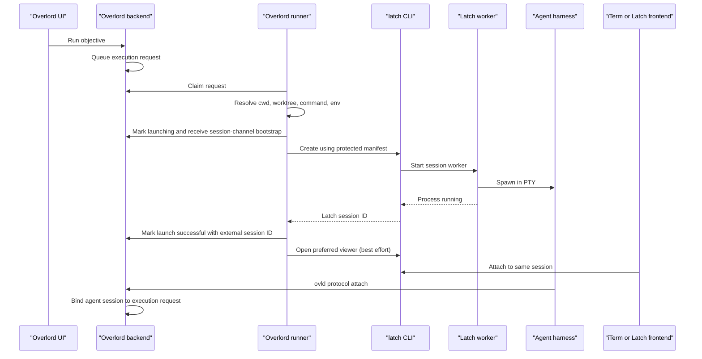

# Integrating Latch with Overlord

## Purpose

This document defines how Overlord can use Latch as a persistent terminal launch
provider while both products remain independently useful and independently
deployable.

The integration must preserve these statements:

1. Latch can create, attach to, and manage sessions without Overlord.
2. Overlord can launch agents directly or through another terminal provider without
   Latch.
3. Overlord integrates through a public Latch CLI or API, never Latch's local session
   directories or cloud tables.
4. Latch owns PTY and attachment lifecycle; Overlord owns mission and agent-work
   lifecycle.
5. Overlord's harness connectors remain the semantic integration path. Latch does
   not replace `ovld protocol` or the Agent Session Exchange.

## Current Overlord launch model

The current runner already performs the orchestration work that should remain in
Overlord:

1. Claim a durable execution request.
2. Resolve the execution target and working directory.
3. Prepare a mission branch and worktree when configured.
4. Resolve the agent, model, reasoning effort, flags, pre-command, project launch
   environment, and pre-launch commands.
5. Write mission briefing/context files and construct the final agent command.
6. Mark the request `launching` and create the Agent Session Exchange bootstrap
   before the process exists.
7. Launch the command inline, through a configured prefix, or by opening a terminal
   application.
8. Mark terminal/command opening as successful or failed.
9. Wait for the agent connector to perform `ovld protocol attach`, which links the
   actual agent session to the execution request and mission.

Today, terminal launch and process presentation are effectively one action: iTerm or
Terminal opens a window and runs the process, or the runner inherits stdio. Latch
separates those responsibilities:

```text
process creation      Latch session worker creates the PTY and process
presentation          iTerm, web, mobile, or another client attaches afterward
```

The runner still decides what to run. It asks Latch to host the resulting command.

## Ownership boundary

| Concern | Latch | Overlord |
| --- | --- | --- |
| PTY and child process | Owns | Does not own |
| Detach, reattach, resize, replay | Owns | Uses through API/SDK |
| Preferred terminal viewer | Owns generic launch integrations; may accept caller preference | Stores the user's per-target selection and requests it |
| Session input control | Owns | Displays and requests through Latch |
| Mission/objective/execution request | Does not understand | Owns |
| Worktree and cwd selection | Receives resolved cwd | Owns resolution |
| Agent command/model/flags | Receives opaque launch specification | Owns resolution |
| Mission context and launch environment | Passes to process without persisting secrets | Owns construction |
| Agent protocol lifecycle | Does not replace | Owns through connectors and protocol |
| Agent Session Exchange | May surface optional extension data | Owns semantic events, decisions, and injection |
| Session termination | Executes a scoped process stop | Decides when to request one based on user action/policy |
| Cloud session discovery | Latch cloud owns | Links or embeds through public APIs |

## User settings

Overlord should separate execution mode from presentation preference. A conceptual
settings model is:

```text
Terminal sessions

Execution mode
  Direct
  Persistent with Latch

Preferred viewer
  iTerm
  Apple Terminal
  Latch web
  Do not open automatically

When a local run starts
  Open the session in the preferred viewer: yes/no

When a viewer closes
  Keep the session running
```

These preferences belong to the existing per-user, per-execution-target launch
settings boundary. A terminal choice is specific to one user and one target, not to
a project or shared objective.

The initial stored representation can extend `terminal_profile_json` with a
versioned provider shape:

```json
{
  "version": 1,
  "executionProvider": {
    "kind": "latch",
    "executable": "latch"
  },
  "viewer": {
    "kind": "iterm",
    "openOnLaunch": true
  }
}
```

Do not store Latch account credentials, local socket tokens, or cloud attachment
grants in Overlord preferences.

## Runner integration contract

### Discovery

Before presenting Latch as available, Overlord runs a read-only capability check:

```bash
latch capabilities --json
```

Example response:

```json
{
  "protocolVersion": 1,
  "productVersion": "0.1.0",
  "capabilities": {
    "create": true,
    "openViewer": true,
    "localAttach": true,
    "cloudAttach": false,
    "extensions": []
  }
}
```

Overlord reports missing or incompatible Latch installations clearly and permits
the user to switch back to direct launch. Overlord does not install or silently
upgrade Latch as a side effect of running a mission.

### Create request

After Overlord has resolved the launch plan, it sends a versioned manifest to Latch
over stdin or a protected local API. Secrets must not appear in argv.

Conceptual command:

```bash
latch create --manifest-file - --json
```

Conceptual manifest:

```json
{
  "version": 1,
  "command": {
    "executable": "codex",
    "args": ["--model", "...", "..."],
    "cwd": "/resolved/mission/worktree",
    "environment": {
      "MISSION_ID": "...",
      "OVERLORD_MISSION_ID": "...",
      "OVERLORD_SESSION_CHANNEL_ID": "...",
      "OVERLORD_BACKEND_URL": "...",
      "OVERLORD_CONTEXT_FILE": "..."
    }
  },
  "terminal": {
    "cols": 120,
    "rows": 36
  },
  "display": {
    "title": "Authentication refactor",
    "commandLabel": "Codex"
  },
  "source": {
    "kind": "overlord",
    "externalRunId": "execution-request-id"
  }
}
```

Latch must treat command and environment as sensitive ephemeral launch material. It
passes them to the worker but stores only bounded display metadata and the opaque
external run ID.

Example response:

```json
{
  "protocolVersion": 1,
  "session": {
    "id": "ses_01J...",
    "name": "authentication-refactor",
    "state": "running",
    "createdAt": "..."
  }
}
```

The runner records the Latch session ID as an external launch/session identifier.
It must not treat that ID as authorization.

### Open viewer

After successful creation, Overlord optionally asks Latch to open the selected
viewer:

```bash
latch open ses_01J... --with iterm --json
```

This is best-effort. Viewer failure produces a warning and an attach action, but the
execution request remains launched because the process is already running.

This reverses the current success boundary:

```text
Current approximation: terminal window opened successfully
Latch boundary:         session worker spawned the process successfully
```

Overlord should still require the normal agent protocol attachment before treating
the execution as a verified live agent session. A Latch process-spawn response proves
only that the command started, not that the harness attached to the correct mission.

### Status and lifecycle

Overlord may inspect a known session:

```bash
latch inspect ses_01J... --json
```

The response distinguishes:

```text
running       verified live worker and primary process
exited        verified process exit, with optional code
stopping      termination underway
lost          session directory exists but the worker cannot be reached and no
              exit record was written
```

`unreachable` is deliberately not in this list. Whether a remote device can currently
be contacted is a property of the caller's connectivity, not of the session, and
Latch's session state machine is `creating -> running -> stopping -> exited`, with
`lost` as the branch for an unverifiable worker. Overlord should render reachability as
its own client-side condition layered over the last known session state, so that a
network problem is never mistaken for something having happened to the process.

Overlord should project this as terminal-session status, separate from mission and
agent-session status. For example, an agent may have delivered its objective while
the shell session remains open, or the terminal process may be running before the
connector attaches.

### Stop behavior

Ending a Latch session is destructive to the live process and must be explicit:

```bash
latch stop ses_01J... --json
```

Overlord should expose two distinct actions:

- **Detach/close viewer:** closes the selected UI attachment and leaves the process.
- **End terminal session:** requests that Latch terminate the selected process group.

Completing or delivering an Overlord objective must not automatically end the Latch
session unless a separately visible user policy enables that behavior. Agents often
leave useful shells, servers, or follow-up context running after delivery.

## End-to-end Overlord launch flow



The Latch create call replaces only the final process/terminal spawn. Queueing,
claiming, worktrees, context construction, Agent Session Exchange bootstrap, and
protocol attachment remain unchanged.

## Mapping Latch and Overlord session identities

The products have different session concepts and should not reuse one ID:

```text
Latch session ID
  identifies one persistent PTY and process group on a device

Overlord agent session ID
  identifies one harness's mission-protocol lifecycle

Overlord agent-session channel ID
  authorizes normalized harness interaction for one launch channel

Execution request ID
  identifies Overlord's queued and claimed launch request
```

A mapping record or additive fields should support:

```text
execution_request_id
execution_target_id
provider = latch
provider_session_id
agent_session_id (nullable until protocol attach)
created_at
last_observed_state
```

Do not overload the native harness resume identifier with the Latch PTY ID. One
Latch shell can theoretically start more than one harness over its lifetime, and a
harness-native resumed conversation may run in a newly created Latch session.

## Manual Latch sessions and Overlord

A user may start Latch independently:

```bash
latch shell --name project-work
```

They can then run ordinary Overlord or agent commands inside it. Because Latch is
only the PTY host, Overlord's normal working-directory discovery and connector
attachment continue to work.

Two manual flows should be supported:

### Launch an Overlord objective from inside Latch

The user attaches to a Latch shell and invokes the normal Overlord launch command.
Overlord detects `LATCH_SESSION_ID` and runs inline in the existing PTY instead of
creating a nested Latch session. It may record the current Latch ID as the external
terminal-session mapping.

### Bind an independently launched agent

The user starts Codex or Claude inside Latch using installed Overlord connectors.
The connector follows its ordinary Overlord binding rules. Latch supplies no mission
authority merely because the process has a cwd or an external metadata label.

The environment marker is correlation only. Overlord authorization continues to
come from its own authenticated protocol and session-channel mechanisms.

## Overlord desktop, web, and mobile experiences

### Local desktop

The mission session panel can show:

```text
Terminal session
  Latch · Running on Jake's Mac
  Viewer: iTerm attached

  [Open in iTerm] [Open embedded terminal] [End session]
```

The initial integration opens the session through the Latch CLI in the user's chosen
terminal. After the TypeScript embeddable client exists, Overlord Desktop attaches that
component **directly to the session's worker socket**.

Overlord Desktop is an Electron application, so its main process can open the Unix
socket and forward frames to the renderer over Electron IPC. **No daemon, gateway, or
other intermediary is required**, and the renderer never needs socket access. This
keeps Latch free of any resident process until the cloud control plane, and keeps
Overlord Desktop off the terminal data path in the same way its backend is.

A Swift component is optional and not part of the initial integration. Overlord does
not proxy terminal bytes through its backend.

### Notifications before Latch has its own

Overlord already knows when an agent needs a human, because its connectors and the
Agent Session Exchange already produce normalized events for permissions, questions,
and turn completion. Those existing hooks should carry notification for the first
integration rather than waiting on Latch push infrastructure.

This matters more than it sounds: remote chat without notification is a polling chore.
Being able to answer a prompt from a phone is only useful if the phone tells you the
prompt exists. Reusing Overlord's pipeline makes that loop testable long before Latch
Cloud exists.

### Remote web/mobile before Latch Cloud

Local-only Latch does not make the session internet-reachable, and Overlord's backend
must not become the thing that does — tunneling raw terminal bytes through the Agent
Session Exchange would make Overlord a terminal relay and collapse the product
boundary.

Until Latch Cloud exists, the honest routes are a copied SSH attach command, or the
user's own SSH client. The latter is a genuinely useful path for developers: SSH to the
device and run `latch attach`, borrowing SSH's reachability and encryption. It requires
the device to be SSH-reachable, so Overlord should present it as what it is rather than
as a supported remote mode.

Consequently, **Overlord Desktop's embedded chat view can ship well before Overlord
mobile's can.** Desktop is local and needs no transport; mobile needs one that does not
yet exist. Splitting them is what keeps the terminal-byte boundary intact.

### Remote web/mobile with Latch Cloud

Overlord requests a short-lived Latch attachment grant through the public Latch
cloud API and passes it to the embedded Latch frontend. The frontend then connects
directly or through the Latch relay.

Overlord's backend never exchanges the grant for database access and does not become
the terminal relay. The embedded component receives only the session-scoped grant
needed for its attachment.

## Relationship to Overlord connectors and widgets

Latch terminal attachment and Overlord Agent Session Exchange are complementary:

```text
Latch terminal plane
  raw terminal input/output, resize, replay, control ownership

Overlord semantic plane
  normalized agent events, permission decisions, follow-up injection, mission state
```

Do not send PTY bytes through `ovld agent-session`. Do not make Latch responsible for
Overlord mission lifecycle.

There are two viable sources for advanced widgets:

1. **Latch-native harness extension:** useful to every application embedding Latch.
2. **Overlord connector event:** useful when the session is bound to Overlord and the
   existing connector already supplies a fixture-proven structured event.

The UI may compose both sources, but actions must have one authority. A permission
request should have one request ID and first-writer-wins resolution even if it is
visible in the terminal, Latch widget, and Overlord mission panel. The integration
should prefer reusing a reliable structured Overlord connector capability rather
than screen-scraping the same interaction again, while keeping Latch's extension SDK
independent of Overlord types.

A bridge can translate an Overlord normalized event into a Latch extension event at
the UI boundary:

```text
Overlord request DTO
  -> Overlord/Latch presentation adapter
  -> generic Latch permission widget model
```

This is presentation composition, not a change in terminal ownership.

## Cloud deployment alongside Overlord on Railway

Latch Cloud can be deployed in the same Railway project as Overlord:

```text
overlord-api
overlord-workers
overlord-postgres
latch-api
latch-relay
latch-postgres (or isolated schema and role)
```

Co-location provides shared operational visibility and low-latency service calls,
but the services remain independent:

- separate public API namespaces;
- separate service credentials;
- separate migrations and database roles;
- no direct cross-product table writes;
- independent health checks and deploys;
- explicit OAuth or service-to-service authorization;
- ability to move Latch to another Railway project later.

For an initial private deployment, the products may share identity infrastructure
or a physical PostgreSQL cluster. Latch must still model its own device and session
authorization rather than assuming that an Overlord workspace membership grants
terminal access.

## Required Overlord changes

### Runner and CLI

- Add a first-class `latch` execution/terminal provider.
- Detect Latch capabilities and version compatibility.
- Serialize a protected launch manifest and parse structured creation output.
- Record the external provider session ID.
- Separate process-spawn success from viewer-open success.
- Detect `LATCH_SESSION_ID` to avoid nesting.
- Add inspect, open, and explicit stop operations through the Latch CLI/API.
- Preserve the existing Agent Session Exchange bootstrap and protocol attach flow.

### Data contract

- Add or formalize an external terminal-session mapping rather than overloading
  native agent resume IDs.
- Snapshot the resolved provider/viewer preference on the execution request.
- Expose bounded provider status in mission/session DTOs.
- Never persist Latch grants or terminal output.

### Settings

- Separate execution provider from preferred viewer.
- Store the choice per user and execution target.
- Show capability and installation diagnostics.
- Preserve direct launch as an always-available fallback.

### User interface

- Display terminal-session state separately from agent state.
- Offer Open, Attach, Copy Attach Command, Detach, and End Session distinctly.
- Initially open sessions through the Latch CLI; later embed the TypeScript frontend
  locally.
- Later request scoped Latch Cloud grants for remote embedding.
- Render harness widgets only when the live capability supports them.

## Integration rollout

Stages map onto the milestones in [`IMPLEMENTATION_PLAN.md`](./IMPLEMENTATION_PLAN.md).

### Stage 1: configuration-only proof — free at Latch M1

If the user's terminal profile already runs `latch`, then Overlord launching an agent
by opening a terminal produces a persistent session with no Overlord changes at all.
This validates command compatibility immediately, but gives Overlord no durable session
ID, so it cannot offer reattach or status.

### Stage 2: first-class local provider — Latch M3

Implement capability discovery, protected create, structured response, and
provider-session mapping. This is the minimum seamless integration and the prerequisite
for anything that needs to know *which* session belongs to a mission.

### Stage 3: embedded local terminal and chat — Latch M3

Embed the TypeScript Latch client in Overlord Desktop, attaching directly to the worker
socket, while keeping iTerm as a first-class alternative. Notifications ride Overlord's
existing agent hooks. This is the first real test of whether agent work reads better as
conversation than as a terminal, so it should land before any widget work.

A native Swift frontend is not required.

### Stage 4: Latch Cloud attachment and mobile chat — Latch M4

Use Latch's public cloud API for session discovery and short-lived remote attachment
grants, and bring the chat view to Overlord mobile on that transport. Keep Latch and
Overlord deployables and schemas independent even when co-located in Railway.

Mobile chat sits here rather than in Stage 3 because it is the first point at which a
transport exists that does not route terminal bytes through Overlord's backend.

### Stage 5: capability-aware widgets — Latch M5

Compose Latch extension widgets and Overlord connector capabilities without duplicating
request authority. Deliberately last: which widgets are worth building depends on what
Stage 3 and Stage 4 reveal about how much conversation view already carries.

## Acceptance criteria

The initial Overlord integration is complete when:

1. A user can choose `Persistent with Latch` for one execution target.
2. The runner creates the Latch session before attempting to open iTerm.
3. Failure to open iTerm does not fail or terminate the launched agent.
4. Closing iTerm leaves the exact agent process running.
5. The user can reopen it from Overlord or with `latch attach`.
6. The agent performs the same Overlord connector attach/update/deliver lifecycle it
   performs without Latch.
7. Overlord records a Latch session mapping without treating the ID as a credential.
8. Manually launched Latch sessions work without Overlord.
9. Direct Overlord launches continue to work without Latch installed.
10. Completing an objective does not unexpectedly terminate the Latch session.
