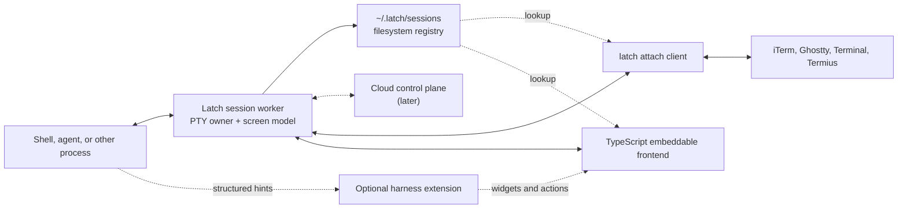

# Latch Project Architecture

> **Status: historical.** This document records the original architecture,
> including the in-process terminal worker and its multi-client attachment
> model. Both were superseded. The worker, framing, attachment registry,
> screen model, and resize-authority modules were archived under the
> `archive/latch-term-v1` tag, and a session now has **at most one human
> surface**: a successful attach always steals it. The sections below on
> multiple watching clients, `watch` versus `control` attachment, and
> controller demotion describe behavior Latch no longer has.
>
> For current behavior see [`../docs/ARCHITECTURE_RULES.md`](../docs/ARCHITECTURE_RULES.md)
> and [`../docs/DECISION_EXCLUSIVE_ATTACH.md`](../docs/DECISION_EXCLUSIVE_ATTACH.md).

## Problem statement

Developers increasingly run long-lived coding agents, development servers, and
interactive tools in terminal windows on their own computers or remote machines.
The process is coupled to the window that launched it: closing the window, changing
devices, or losing a connection commonly interrupts the work or forces the user to
recover it with a terminal multiplexer.

Tools such as tmux solve process persistence, but they also introduce their own
window model, keybindings, configuration, and attachment workflow. Many developers
want the persistence without adopting a new terminal interface. They want to keep
using iTerm, Ghostty, Terminal, or another terminal locally, then attach to the same
live session from a browser or phone when away from their desk.

Agent work creates an additional opportunity. Most interaction with a coding agent
is conversational, so a web or mobile terminal can present the live terminal in a
clean, chat-like form. Over time, harness-specific enhancements can recognize
permissions, questions, tool activity, diffs, and completion events and render
purpose-built controls. The terminal must nevertheless remain authoritative and
available as the universal fallback.

Latch solves this by separating the lifetime of a terminal session from any window
displaying it:

> A process runs in a persistent terminal session on a developer-controlled device.
> Any compatible terminal, web view, mobile view, or embedding application can
> attach to that same session.

Latch is useful independently of Overlord. Overlord is one orchestration client that
can ask Latch to create a session and associate it with a mission; neither product is
required for the other to function.

## Product principles

1. **The process stays on the selected device.** Latch does not move a local shell or
   agent into a hosted execution environment.
2. **The PTY is authoritative.** Rich UI is a projection over the live terminal, not
   a parallel conversation that can diverge from it.
3. **Existing terminals remain first-class.** A user can attach through iTerm or any
   other terminal capable of running the Latch CLI.
4. **Detaching is not terminating.** Closing a viewer leaves the session running.
5. **Enhancements are optional.** Components 1 through 3 provide a complete terminal
   experience without any harness-specific extension.
6. **Local-first is a complete mode.** The initial product needs no Latch account or
   cloud service.
7. **Cloud is a control plane, not the session host.** The later cloud service helps
   devices discover and securely reach sessions; it does not become the authority
   for the process or PTY.
8. **Privacy is the default.** Environment variables, credentials, raw terminal
   output, and scrollback are not placed in cloud metadata.

## System overview



Clients look a session up through the filesystem, then connect **directly** to that
session's worker. Nothing sits between a client and the PTY on the interactive path,
so keystroke latency has no intermediary and no supervising process can fail in a way
that drops a live terminal.

## The four major components

### 1. Persistent terminal service

The terminal service runs on the device where the work happens. In the first release
it is a single Rust binary on macOS, acting as both the CLI and — in worker mode — the
per-session PTY owner. There is no registry daemon, no database, and no service
manager. The initial product is CLI-only: there is no Swift configuration application,
and closing every terminal client leaves the workers running.

The session worker owns:

- PTY allocation and configuration;
- the primary child process and its process group;
- terminal input, output, and resize handling;
- **a live headless terminal emulator maintaining the current screen state**;
- a bounded output journal;
- attachment presence and which attachment holds input control;
- the authoritative session size;
- exit detection and final status;
- its own control socket.

**The screen model is the substrate, not an optimization.** A byte-replay buffer
cannot restore an alternate-screen application: replaying a byte tail can begin
mid-escape-sequence, paint only part of a full-screen redraw, and never restores modes
set before the replay window. Claude Code and Codex use all of these, and every mobile
app-backgrounding is a detach and reattach. The worker therefore parses output into a
full screen model and can serialize that screen into a self-contained ANSI sequence
that reconstructs it exactly from a reset terminal.

The same model carries three other requirements: a slow client is resynchronized with
a fresh snapshot instead of an unbounded buffer, scrollback is a bounded structured
ring rather than a byte log, and conversation view can ask directly whether the
alternate screen is active rather than guessing from raw bytes.

#### Session discovery without a registry

Sessions are discovered through the filesystem. Each worker owns a directory holding
its socket, its metadata, and its journal:

```text
~/.latch/
  config.toml                  # non-secret preferences
  sessions/
    ses_01J.../
      meta.json                # written once at spawn (temp file + rename)
      control.sock             # worker socket; connectable == alive
      journal                  # bounded output journal
      exit.json                # written by the worker at exit
```

`~/.latch` and each session directory are mode `0700`; sockets are `0600`.

**Session state is derived, never stored:**

```text
socket accepts a connection      -> ask the worker (creating | running | stopping)
exit.json present, socket gone   -> exited
neither                          -> lost
```

This removes an entire class of lying-registry bugs. There is no stored state to
diverge from reality, nothing to reconcile after a restart, and no schema to migrate.
It also makes the stale-PID rule structural rather than a discipline: `latch stop`
sends a message to the live worker, which signals its own child's process group. No
stored PID is ever consulted for a kill.

`meta.json` holds only bounded display metadata — id, name, title, cwd, a redacted
command label, creation time, initial size, and an opaque external run ID. Secrets,
full environment blocks, raw authorization tokens, and full argv never appear in it.
Launch material arrives over stdin or the socket and lives only in worker memory. The
journal may contain terminal output so reconnecting clients can reconstruct history;
it is owner-only, capped by configuration, and deleted with the session.

A resident process is introduced only where one is genuinely required, which is cloud
presence and rendezvous. Nothing before that needs one: the first embedding host,
Overlord Desktop, is an Electron application whose main process opens the worker socket
directly and forwards frames to its renderer. A loopback WebSocket gateway would only
be needed for a true browser context with no Node process available, which does not
arise before the cloud control plane makes it moot.

### 2. Terminal attachment layer

The attachment layer makes a Latch session appear inside any ordinary terminal.
It consists of a documented protocol and a small CLI client. It is not a separate
plugin for every terminal application.

The user runs:

```bash
latch attach <session>
```

The client puts the current terminal into raw mode, connects to the session's worker
socket, forwards input bytes and resize events, renders output bytes, and restores the
local terminal on exit. From iTerm's perspective, this behaves like a directly running
interactive program.

The same protocol supports embeddable clients. It is one duplex byte stream — a Unix
socket locally, the same frame vocabulary over a WebSocket remotely — so the codec is
transport-agnostic:

```text
u8   type
u32  length (big-endian)
[u8] payload

0x01  terminal.output   raw bytes  (hot path, no structured decode)
0x02  terminal.input    raw bytes  (hot path)
0x10  control           MessagePack object with a `t` discriminator
```

Keeping output and input as bare binary types keeps the interactive path
allocation-free. The versioned control vocabulary is deliberately small, because every
message multiplies across the per-language fixture suites:

```text
attach          { protocol, mode: watch|control, steal, client, size }
attached        { protocol, session, controller, attachments }
resize          { cols, rows }
control.request { steal }
control.state   { controller_id, controller_label }     // broadcast
session.update  { state?, attachments?, title? }        // presence and state, merged
session.exited  { code, signal, at }
error           { code, message }
```

**The screen snapshot is not a message.** After `attached`, the worker sends the
serialized screen as ordinary `terminal.output` frames and then continues with live
output. Reconnecting is therefore just attaching — there is no replay negotiation, no
sequence-number bookkeeping on the client, and no second code path to get wrong.
Because clients connect to a per-session socket, there is also no session to negotiate
and no separate hello; version negotiation rides `attach`, and an unsupported version
produces `error` and a close rather than a guess.

Multiple clients may watch a session, but at most one holds input control. A client
declares `watch` or `control` at attach time; requesting control while another client
holds it returns `control_busy` unless `steal` is set, in which case the current
controller is demoted and notified. **Control is released by socket close, not by timer
expiry** — locally the operating system already reports departure precisely, so a lease
timer could only be wrong relative to it. Timed leases are introduced later alongside
remote clients, where a connection can hang without closing.

#### Resize authority

A phone is roughly 40 columns and a desktop terminal is roughly 200. For this product
that is the ordinary configuration, not an edge case, so the policy is explicit:

**The session's size is the current controller's size. When a controller detaches, the
size reverts to what was in effect before it took control.** Watchers never resize the
session.

The phone takes control and the session reflows so the agent is usable on it; the phone
disconnects and the session returns to its desk geometry. An explicit resize command
overrides this, and can pin a size against controller-driven changes.

Terminal-specific launch integrations are conveniences over the universal attach
command. For example, the iTerm integration opens a new window or tab running:

```bash
latch attach <session-id>
```

Failure to open iTerm must never stop or invalidate the session.

### 3. Embeddable TypeScript and Swift terminal frontends

Latch ships first-party clients that attach through the same protocol as the CLI:

- a TypeScript package for web, React, and Electron applications;
- a Swift package for macOS, iOS, and iPadOS applications.

These frontends follow the CLI-only local release. They are part of the product
architecture, but neither is required to prove or ship persistent local sessions.
In particular, the first release does not include a SwiftUI configuration or
management application. Configuration, session inspection, and diagnostics are
performed through the CLI.

The baseline frontend is a real VT-compatible terminal renderer. It must correctly
handle ANSI styling, cursor movement, alternate-screen applications, resizing,
Unicode, bracketed paste, and ordinary interactive programs. The first web version
may build on a mature emulator such as xterm.js; the Swift version may build on a
maintained native terminal-emulation core. These dependencies should be hidden
behind Latch's own session-view API.

The frontend provides two presentations of the same attachment:

1. **Terminal view** renders the exact live terminal and supports arbitrary
   applications.
2. **Conversation view** uses typography, spacing, input composition, and output
   grouping to make common agent interaction comfortable on web and mobile.

Conversation view does not claim to reconstruct a perfect semantic transcript. It
groups submitted input and subsequent output where reliable, while falling back to
an embedded terminal surface whenever the application uses complex cursor movement,
the alternate screen, or input behavior that cannot safely be represented as chat.
Switching presentations does not reconnect or create another session.

Baseline frontend features include:

- connection, reconnect, and session-state indicators;
- watch and control modes;
- searchable scrollback;
- high-quality typography and configurable fonts;
- selection, copying, and labeled text captures;
- collapsing and expanding noisy output regions;
- safe multiline paste confirmation;
- mobile controls for Escape, Control, Tab, arrows, and interrupt;
- a message-style composer that sends text followed by Enter;
- a one-action switch to the full terminal;
- extension slots for harness-specific widgets.

### 4. Harness-specific enhancements

Harness enhancements progressively improve supported agent experiences without
changing the underlying session model. Each enhancement has two parts:

1. A session-side adapter that emits bounded structured events and accepts exact
   actions for one harness interaction.
2. TypeScript and Swift components that render those events as widgets.

Possible events include:

```text
extension.codex.permission_requested
extension.codex.tool_started
extension.codex.file_modified
extension.codex.question_presented
extension.codex.turn_completed

extension.claude.permission_requested
extension.claude.plan_presented
extension.claude.turn_completed
```

Possible widgets include permission choices, structured questions, plan approval,
diff previews, tool activity, test results, generated-file links, and completion
summaries.

Reliable consequential widgets must use structured harness mechanisms when
available. Screen recognition may improve presentation, but it must not silently
approve a permission or send a consequential answer. Every actionable widget is
bound to a unique request identifier and revision. If the user answers through an
ordinary terminal, the widget becomes resolved or stale rather than remaining
actionable.

The invariants are:

- the harness process and PTY remain authoritative;
- the session is fully usable without the enhancement;
- a widget cannot answer a different or later prompt;
- actions taken from one client are visible to other clients;
- unsupported interactions always offer the real terminal.

Enhancements are sequenced last among feature work, deliberately. Which widgets are
worth building depends on how much of agent interaction the conversation presentation
already carries comfortably, and that is not knowable until a conversation client has
been used against real sessions. Building the extension SDK first would mean designing
for guesses.

There is also a shortcut worth taking before any Latch-native adapter exists. An
orchestration client that already runs harness connectors — Overlord does — already
produces normalized, fixture-proven structured events for permissions, questions, and
turn completion. Those can drive the first widgets and the first notifications, which
means the widget hypothesis can be tested before Latch's own extension surface is
designed, and the SDK can then be generalized from something that demonstrably worked.

## Exact local-only behavior

### Installation and startup

1. The user installs a single `latch` binary.
2. First run creates the owner-only `~/.latch` directory for session directories and
   non-secret configuration.
3. The user optionally points their terminal profile's command at `latch`, so every
   new window is already a persistent session.
4. No service registration, no account, and no network connection is required.

Step 3 is the intended adoption path and it is configuration rather than code. These
users already have a terminal they like; the product's job is to make persistence free
rather than to become a terminal. Because every window then runs `latch`, two things
follow: CLI startup must be imperceptible, and nesting must be detected — `latch`
inside a Latch session attaches or declines rather than creating a session within a
session.

### Creating a session manually

The simplest command creates a persistent shell and attaches the invoking terminal:

```bash
latch
```

Explicit forms include:

```bash
latch shell --name backend
latch run --name auth-refactor -- codex
latch run --name server -- npm run dev
```

The flow is:

1. The CLI allocates a session ID and directory, then spawns a detached worker
   (`setsid`) with the command, cwd, terminal size, and non-secret display metadata.
2. The worker creates the PTY and spawns the requested command in its own process
   group, then writes `meta.json` and begins listening on its control socket.
3. The CLI connects to that socket and attaches with `control`.
4. The worker sends the current screen, then live output.
5. **The CLI is not the session's parent process.** Terminating the CLI or closing its
   window detaches it without signaling the session process, and the worker is
   unaffected because it was never a child of the terminal.

The CLI holding input control and the CLI not owning the session's lifetime are
separate facts: it drives the keyboard, but nothing about the process depends on it
surviving.

Command and environment transfer must avoid exposing secrets in process listings.
The create API should accept an owner-only launch manifest over stdin or the local
socket. Only a redacted command label is stored.

### Creating a session from another application

An application such as Overlord calls the same local API or CLI and receives a
machine-readable response:

```json
{
  "protocolVersion": 1,
  "session": {
    "id": "ses_01J...",
    "name": "authentication-refactor",
    "state": "running"
  }
}
```

Creation and presentation are separate. After creation succeeds, the caller may
ask Latch to open the session in the preferred terminal. If no viewer opens, the
session continues running.

### Attaching and switching devices locally

The user lists and attaches to sessions with:

```bash
latch list
latch attach authentication-refactor
```

A TypeScript or Swift frontend performs the same attach handshake. Clients receive the
session's current screen before live frames. Watching does not grant input control. A
client requests control explicitly, and the transfer is broadcast to every attachment.

Before the cloud control plane exists, a phone reaches a session over SSH: connect to
the device with any SSH client and run `latch attach`. This borrows SSH's reachability,
authentication, and encryption rather than building Latch equivalents, and it is enough
to prove whether remote agent interaction is worth wanting. It requires the device to
be SSH-reachable, so it is a path for the product's own developers rather than a
shipped capability — but it exercises the hardest cases in the design first: cell
networks, constant reattach as a mobile client backgrounds, and a 40-column screen
attached to a session created at 200.

### Detaching and ending

These actions are distinct:

```text
Close terminal window       detach; session keeps running
Disconnect web/mobile view  detach; session keeps running
Type exit or Ctrl-D          primary shell exits; session ends
Primary command exits       session ends
latch stop <session>        explicitly terminate the process group
```

`latch stop` first sends the configured graceful termination signal, waits a bounded
interval, and then offers or performs a force stop according to explicit CLI/UI
behavior. It never targets a PID read from storage: the command is delivered to the
live worker over its socket, and the worker signals its own child's process group. A
session whose socket does not answer cannot be stopped because there is nothing left
to stop — which makes the stale-PID guarantee structural rather than a rule to
remember.

### Restart and recovery

- A frontend restart is an ordinary detach and reattach. So is a mobile client
  backgrounding and returning, which is why reattach fidelity is not a refinement.
- There is nothing to reconcile: no registry process exists, and session state is
  derived from the socket and exit record rather than stored.
- A worker that dies without writing an exit record leaves a directory whose socket
  refuses connections. That is reported as `lost` and reclaimed by `latch prune`.
- A machine reboot ends initial-version sessions. Latch reports them as interrupted;
  it does not claim byte-for-byte process persistence across reboots.
- Later harness-native resume may offer a new session based on an agent's saved
  conversation, but that is not the same as restoring a PTY and must be labeled
  separately.

## Cloud control plane

The local-only product remains complete. The cloud version adds account-based
discovery and secure connectivity between devices. It will be deployed as an
independent Railway service and may be placed in the same Railway project as
Overlord for operational convenience.

Co-location must not collapse the product boundary. Latch uses its own service API,
database schema or database, migrations, credentials, and deployable. Overlord
integrates as an API client rather than writing Latch tables.

### Cloud responsibilities

The cloud service owns:

- accounts, organizations, and device membership;
- device public keys and revocation;
- a directory of active session summaries;
- device and session presence heartbeats;
- short-lived, session-scoped attachment grants;
- direct-connection rendezvous and connection candidates;
- encrypted relay coordination when direct connectivity fails;
- push-notification registration and delivery;
- access audit events and sharing policy;
- extension catalog metadata where appropriate.

The cloud service does not own:

- the PTY or session process;
- authoritative running/exited state;
- raw environment blocks or local credentials;
- persisted terminal scrollback or transcripts by default;
- filesystem access on the execution device;
- Overlord missions, objectives, or execution-request state.

### Cloud data model

A cloud session directory entry is intentionally small:

```text
devices
  id
  account_id
  display_name
  platform
  public_key
  revoked_at
  last_seen_at

session_directory_entries
  id
  device_id
  local_session_id
  title
  state_summary
  capability_summary
  created_at
  last_heartbeat_at
  ended_at

attachment_grants
  id
  session_directory_entry_id
  actor_id
  mode
  token_hash
  expires_at
  consumed_at

connection_candidates
  device_id
  candidate
  expires_at

access_events
  actor_id
  device_id
  session_id
  action
  created_at
```

The local device remains authoritative. A missed heartbeat means unreachable or
unknown, not necessarily exited.

### Remote attachment flow

1. A resident device agent — the first component in the product that must run
   continuously, introduced with the cloud — authenticates using a device-bound key and
   publishes bounded session-directory heartbeats.
2. A web, mobile, or CLI client signs in and lists sessions it is authorized to
   access.
3. The client requests a short-lived grant for one session and one mode (`watch` or
   `control`).
4. The cloud authorizes the request and coordinates connection candidates.
5. Client and device prefer a direct encrypted connection.
6. If direct connectivity fails, they connect through the Railway-hosted relay.
7. Terminal frames are end-to-end encrypted between the client and the device so
   the relay cannot interpret them.
8. The device agent validates the grant, attaches to the worker, and applies the same
   input-control rules used by local clients — plus lease expiry, which exists here
   because a remote connection can hang without closing.
9. Revocation or expiry prevents new attachment; explicit revocation terminates an
   active remote attachment according to policy but does not stop the session.

### Relationship to Railway and Overlord

Railway is the deployment environment, not an architectural coupling. A likely
Railway project can contain:

```text
Overlord backend service
Overlord database
Latch control-plane service
Latch relay service
Latch PostgreSQL database or isolated schema
```

Early deployments may share a PostgreSQL cluster to reduce cost, provided separate
roles and schemas prevent either service from bypassing the other's API. The relay
can initially live in the control-plane process but should remain a separable module
because its scaling and bandwidth profile differ from metadata APIs.

## Security and privacy requirements

- Session directories, sockets, journals, and configuration are owner-only.
- Launch secrets travel over stdin or the local socket, never command-line arguments
  or stored session metadata.
- Externally supplied display metadata — session names, titles, and anything arriving
  in a launch manifest — is sanitized to printable characters **at ingest, not at
  render**. A mission title flows from a caller into terminal titles and `latch list`
  output, so escape sequences must be neutralized once, at the boundary, rather than at
  every present and future display site.
- **Any process running as the same user can attach to a session and type into it.**
  This is inherent to a local socket owned by the user, and is the same trust boundary
  tmux has. It is an accepted limitation, not something local authentication solves;
  the mitigations are filesystem modes and the fact that sessions are visible and
  attributable, not access control between a user's own processes.
- Remote attachment uses short-lived session-scoped grants, never an account-wide
  bearer token at the device endpoint.
- Watch and control are separate permissions.
- Controller actions carry client identity and are auditable.
- Cloud session metadata is bounded and excludes raw terminal content.
- Relay traffic is end-to-end encrypted before the first production cloud release.
- Terminal captures are explicit user artifacts, not automatic cloud transcripts.
- Session termination is revision-checked and scoped to one verified live worker.

## Non-goals for the local MVP

- Replacing iTerm, Ghostty, or other local terminal applications.
- Implementing panes, windows, or a tmux-compatible command language.
- Persisting a running process across machine reboot.
- Perfectly reconstructing semantic chat turns from arbitrary terminal output.
- Supporting simultaneous uncontrolled keyboard writers.
- Sharing sessions between operating-system users.
- Cloud accounts, remote relay, or team collaboration.
- Requiring Overlord for session creation or attachment.
- Requiring harness-specific integrations for basic terminal use.
- A resident background process, a local database, or service registration. The MVP is
  one binary and a directory; a supervised process is added only where one is genuinely
  required.
- A shipped remote-access story. Reaching a session from a phone over SSH is a
  development path that borrows SSH's reachability to prove the demand early; it is not
  a supported product capability until the cloud control plane exists.

## Success criteria

The CLI-only local MVP succeeds when a user can:

1. Start Codex, Claude Code, a shell, or a development server in Latch.
2. Point a terminal profile at `latch` so every window is persistent, and notice no
   difference in how the terminal behaves — including how fast a window opens.
3. Close the originating terminal window without stopping the process.
4. List and reattach to the exact session from any ordinary local terminal, and have
   the reattached screen match what a continuously attached client shows —
   **identically**, including alternate-screen applications mid-run.
5. Attach from multiple terminal applications and see which client owns keyboard input.
6. Transfer terminal control without creating simultaneous uncontrolled writers.
7. Attach from a phone over SSH, take control, answer an agent's prompt, disconnect,
   and find the desk session's geometry unchanged.
8. Explicitly end the session and its process group.
9. Configure and diagnose Latch entirely from the CLI.
10. Use all of the above without a daemon, database, service registration, Swift
    application, cloud account, or Overlord.

Criterion 4 is the one that decides whether the product works. Every mobile
reattachment depends on it, and no amount of later polish compensates for getting it
approximately right.

The later embeddable-frontend milestone succeeds when TypeScript and, eventually,
Swift clients can attach to these same sessions without changing the worker or the
attachment protocol.
