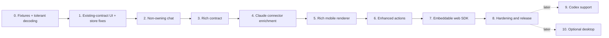

# Rich Conversation UI implementation guide

**Status:** proposed implementation sequence, revised after reading the current
Hub, connector, contract generators, and mobile store.
**Functionality:**
[`../docs/FEATURE_RICH_CONVERSATION_UI.md`](../docs/FEATURE_RICH_CONVERSATION_UI.md).

## Objective

Turn the existing protocol-major-2 Conversation Hub and mobile chat into a
user-friendly coding-agent conversation, then expose the same behavior through
a minimalist embeddable web SDK. Preserve Latch's current authority, security,
operation, and terminal boundaries. Codex conversation support and a native
desktop conversation surface are later optional follow-ups, not dependencies of
the mobile-and-SDK release.

## What this revision changed

The first draft assumed a richer starting point than exists. Five corrections
drive the re-cut below:

1. **The answer path is a keystroke against scraped screen text**, not a
   provider API. This removes multi-select and free-text answers from scope and
   makes approvals the first thing to fix rather than a rendering task.
2. **Codex has no working connector.** What exists is a generic reader for an
   invented record format that nothing emits, bound by an environment variable
   nothing sets. Codex becomes its own phase.
3. **Forward-compatible decoding must ship before the rich contract**, because
   the client that has to tolerate rich fields is the one already installed.
   Today an unknown item kind drops the socket and starts a reconnect loop.
4. **Most "rich" data is already parsed and then discarded** at the connector.
   Tool inputs, correlated results, error status, and structured question inputs
   are all read today and thrown away. This is the cheapest work in the plan and
   it moved earlier.
5. **The client store has correctness bugs that the rich model would amplify**,
   including history paging that discards the page it just fetched. These move
   into Phase 1 rather than being measured in Phase 8.

## Verified starting conditions

Recorded with locations so the phases below are not re-litigated. All were read
from the working tree, not inferred.

### Hub and contract

- `crates/latch/src/conversation/` owns the Hub, projection, cache, connector
  boundary, and JSONL connector.
- `schemas/remote-access/v2/` owns the public wire contract. Every object uses
  `additionalProperties: false`.
- Hub budgets (`hub.rs:22-42`) are hard constraints on any rich model:
  `MAX_MESSAGE_TEXT_BYTES` 16 KiB, `MAX_CONVERSATION_ITEM_BYTES` 32 KiB,
  `MAX_CONVERSATION_BATCH_BYTES` 256 KiB, `MAX_CONVERSATION_SNAPSHOT_BYTES`
  512 KiB, `SNAPSHOT_PAGE` 100 items, `MAX_RETAINED_MUTATIONS` 512 /
  `MAX_RETAINED_BYTES` 512 KiB (the resume window), and a per-subscriber queue
  of 128 messages / 256 KiB.
- `ConversationState` (`conversation-state.schema.json`) hardcodes exactly two
  operations, `sendMessage` and `resolveRequest`, as named fields. There is no
  generic action-availability map on the wire, even though the connector layer
  already models one (`pending.rs:46-56`, `ActionDescriptor { id,
  required_grant, enabled, reason }`).
- `resolve_request` (`conversation-protocol.schema.json`) carries
  `operationEpoch`, `operationId`, `requestId`, and `choice`. **There is no
  revision or fence field**, so the feature's revision-bound guarantee is not
  currently expressible.
- `conversation-item.schema.json` allows `choices: maxItems 128`. The resolve
  mechanism supports at most 9. The schema bound is unreachable.

### There are two contract generators, and neither generates

- `scripts/generate-remote-access-types.py` writes **Rust**
  (`crates/latch/src/cli/serve/contract.rs`) and **TypeScript**
  (`packages/client/src/generated.ts`).
- `apps/LatchMobile/Tools/generate-contract.py` writes **Swift**
  (`Sources/LatchMobileKit/Generated/LatchContract.swift`), re-vendors schema
  copies into `apps/LatchMobile/Contract/schemas/`, and rewrites
  `Contract/manifest.json`.
- Both are hand-maintained source literals guarded by a schema SHA-256. Nothing
  derives a type from a schema and **nothing validates an emitted payload
  against a schema**. Each new field is four coordinated hand edits.

### Client decoding is strict and fails closed

- `LatchContract.swift:266` throws on an unknown `kind.type`;
  `LatchContract.swift:354` decodes `[ConversationItem]` all-or-nothing.
- `ConversationSocket.swift:136-146` lets that throw exit the receive loop,
  which drops the connection and reconnects with backoff — so the server
  re-sends the same undecodable frame and the client loops permanently.
- Conversely, unknown *properties* are already ignored (keyed container
  decoding), and `MessageStatus` already falls back to `.complete`
  (`LatchContract.swift:226-229`). `role`, `requestType`, and tool `status` are
  all `String` in Swift (`LatchContract.swift:233-235`), so widening those enums
  is safe. The first draft's claim that widening the role enum would break the
  decoder was wrong; adding a fourth `kind.type` is the real hazard.

### The connector is a transcript reader, a screen scraper, and a keystroke sender

- Send is `ConversationControl::submit` — a paste into the PTY via the latchd
  unix socket (`engine.rs:375`, `engine.rs:286-297`), gated on a screen check
  that the composer is empty (`jsonl.rs:1104`) and on there being no pending
  request and no running tool (`jsonl.rs:1061-1064`).
- Resolve matches the request against rendered screen text
  (`jsonl.rs:1112`), then finds a line of the form `N. <exact label>` and presses
  that digit (`jsonl.rs:789-803`, `jsonl.rs:1117-1123`). Digits 1–9 only,
  single-line label match, exact case-insensitive equality.
- `key()` accepts an arbitrary key sequence (`engine.rs:391`), so Esc and arrows
  are mechanically available.
- Claude permission requests synthesize `choices: ["Allow once", "Deny"]`
  (`jsonl.rs:680`). Those strings will not appear on Claude's rendered prompt, so
  `visible_choice_key` returns `None` and the resolve is refused. **Reproduce
  this on a real session before anything else in this plan.**

### The connector already reads what the rich model wants

- Claude `tool_use` blocks are parsed with their `input`, and `tool_result` is
  correlated by `tool_use_id` (`jsonl.rs:563-580`, `jsonl.rs:613-627`). The
  result content is then replaced with the literal string `"completed"` and the
  status is hardcoded to `Succeeded`, so **failed tools cannot currently be
  represented at all**.
- `parent_message_id` is already populated for tool calls (`jsonl.rs:625-627`).
- `AskUserQuestion`'s full structured input — headers, per-option descriptions,
  multiple questions — is available and flattened to a prompt string plus a
  choice list (`jsonl.rs:630-640`).
- `thinking` blocks fall through the assistant block match's `_ => {}` arm
  (`jsonl.rs:597`) and are dropped.

### Only two Claude hooks are installed

`observer.rs:177-183` registers `SessionStart` and `PermissionRequest` and
nothing else. There is no `Stop`, `PostToolUse`, or `Notification` hook, so
**no turn-completion boundary exists**. Adding hooks is a one-line change to
that JSON.

### Codex support does not exist

`self.id == "claude"` is the only real translation branch (`jsonl.rs:351`).
Everything else falls through to a generic reader expecting
`{"event":"user_message"}` / `{"event":"tool_call"}` /
`{"event":"approval_request","choices":[...]}` records.
`fixtures/conversation/codex/source-corpus.jsonl` is written in that invented
shape and is not Codex's rollout format. Nothing in the repository sets
`LATCH_CODEX_CONVERSATION_SOURCE`, the only way a Codex session acquires a
source binding (`observer.rs:75-84`), so a Codex session never binds. The
existing "conformance suite" proves two self-authored fixtures agree with each
other.

### Chat currently takes the terminal, and does not need to

- `ChatView.swift:48-62` claims the terminal and drains it, via
  `AppModel.claimTerminalForChat` (`AppModel.swift:733-746`), which calls
  `unlockTerminal` (`AppModel.swift:367-372`) — so **opening a read-only chat
  raises a Face ID prompt reading "Open a terminal on your Mac and run commands
  on it."**
- The attach resizes the PTY unless pinned and never restores on detach
  (`daemon.rs:825-831`).
- The justification in the comment is unnecessary: latchd always drains the PTY
  and evicts slow surfaces rather than waiting on them (`daemon.rs:52-61`). The
  `slow_client` eviction is gateway-side (`terminal.rs:237`) and applies only to
  a socket the phone itself created. Send and resolve never use the terminal
  WebSocket.

### The mobile store has three defects the rich model would amplify

- Published items are capped at 300 items / 512 KiB
  (`ConversationStore.swift:136-137`), so the 1,000- and 10,000-row measurements
  in the first draft cannot occur in the real app.
- `bounded` drops from the **front** (`ConversationStore.swift:542-552`), so
  `loadOlder` (`ConversationStore.swift:229`) fetches a page of older items that
  is then immediately trimmed off. History paging past the cap is a no-op.
- `publishImmediately` runs on a 16 ms cadence
  (`ConversationStore.swift:507-521`) and calls `bounded`, whose `while` loop
  JSON-encodes the **entire** item array on each iteration, then `persist`
  (`ConversationStore.swift:529-540`) atomically rewrites the whole cache file.
  That is transcript-wide work per append, on the client.
- `FileConversationStoreStorage` (`ConversationStore.swift:77-100`) writes that
  cache with no `FileProtectionType` and no backup exclusion.

### Miscellaneous

- `ChatView.swift:177` compares tool status to `"complete"`; the schema enum is
  `running | succeeded | failed`. The checkmark never renders. All four of these
  enums are `String` in Swift, so the compiler cannot catch this class of bug.
- `scripts/check-boundaries.sh:41-60` hard-fails if `examples/remote-sdk-react`,
  `packages/chat-react`, or `packages/harness-schema` exist. The Phase 7 example
  embed must not use the first of those paths, and the SDK package name
  `@latch/conversation-react` is chosen to avoid the second.

## Architectural decisions

### 1. The Hub remains the only public conversation authority

Provider transcript records, hook events, and terminal screen checks are
reconciled by a connector on the host. Mobile, the web SDK, and any future
desktop view receive one ordered projection. No client-side source precedence,
fuzzy text deduplication, transcript discovery, or terminal scraping is
introduced.

When a connector has several forms of evidence, its internal authority order is:

```text
provider structured event or stable native record
    > bound agent transcript
    > owner-installed observation hook
    > terminal screen inference
```

The terminal screen may confirm liveness, composer availability, or prompt
absence. It does not become an alternate source for assistant prose when an
authoritative agent source exists.

### 2. Rich semantics extend existing items before adding new item kinds

The first enriched contract keeps the current `message`, `tool`, and `request`
variants. Optional fields add structured detail while the existing required
`text` and `summary` values remain usable fallbacks.

The blast radius that matters is a **new top-level `kind.type`**, which the
current Swift decoder rejects outright and which currently takes the whole
socket down with it. Widening the `role`, `requestType`, or tool `status` enums
is safe against today's Swift, because all three decode as `String`. Adding a
fourth item kind requires either the tolerant decoding from Phase 0 to be widely
deployed first, or a new protocol major.

### 3. Presentation is a pure projection

SwiftUI and the web SDK receive generated contract values plus local
presentation state. Pure helpers group items into turns, derive activity
summaries, and decide whether the viewport should follow the tail. Views do not
mutate conversation history or infer interaction permission. Platform renderers
may differ visually, but shared fixtures must produce equivalent turns, tool
groups, requests, and operation states.

### 4. Chat observation is not a terminal attachment

A Conversation Hub subscriber is not a human terminal surface. Opening Chat must
not call the terminal attach route, must not resize the PTY, and must not
require owner authentication. The code already shows the drain is unnecessary;
what remains to establish is the geometry consequence, which decision 6 covers.

### 5. A control is offered only when the host can confirm the submission

Attachments, turn cancellation, option selection, and commands are shown only
when advertised. Beyond advertisement, the host must be able to confirm at
submission time that the action it is about to take corresponds to the choice
the user saw. This is what rules out multi-select and free-text answers on the
current mechanism: a blind key sequence against a moving cursor cannot be
confirmed, and an unconfirmable answer to a permission prompt is a security
problem rather than a UX compromise.

### 6. Screen-dependent actions have a geometry dependency that must be owned

Send and resolve both validate against the rendered screen, and the rendered
screen's width is set by whichever surface last attached. Removing the phone's
attach changes that width. Any change to attach behavior must be validated
against send and resolve at desktop-wide, narrow, and never-attached geometries.
Pinning the PTY size (`daemon.rs:825`) is an available lever and should be
evaluated rather than discovered later.

## Proposed additive contract

The precise schema is written in Phase 3, after compatibility fixtures exist.
The target shape is:

```text
ConversationItem
  id
  ordinal
  createdAt
  turnId?                 stable grouping boundary
  kind

message
  role                    existing user | assistant
  text                    required plain/Markdown fallback
  status                  existing lifecycle
  blocks?                 ordered rich content

tool
  name
  summary                 required fallback
  status                  widened: running | succeeded | failed | stopped | unknown
  parentMessageId?
  callId?                 provider-native correlation
  category?               read | search | command | edit | network | agent | other
  inputPreview?           bounded, sanitized display value
  resultPreview?          bounded, sanitized display value
  isError?
  patch?                  bounded path + resolved hunks

request
  requestId
  requestType
  prompt                  required fallback
  choices                 required fallback
  status
  revision?               connector-owned request revision/fence
  questions?              grouped structured questions
  approval?               structured approval description and decisions
```

The initial block vocabulary is deliberately small:

- `text` with a presentation hint such as `prose`, `reasoning`, or `notice`;
- `code` when a provider supplies code as a distinct block; and
- clients skip block types they do not know.

`image_ref` is deferred with the attachment work.

Two contract changes beyond the item model belong in the same phase, because
deferring them makes every later phase a schema revision:

- **`resolve_request` gains the request revision.** Without it the feature's
  revision-bound guarantee is unimplementable and the only fence is the
  connector's "is this still the current pending request" check.
- **`ConversationState` gains a keyed action-availability map** alongside the
  existing `sendMessage` / `resolveRequest` fields, mirroring the
  `ActionDescriptor` the connector layer already produces. Otherwise every
  Phase 6 slice adds another named field across four hand-edited type surfaces.

### Fitting the budgets

Every message with blocks also carries `text`; every tool with detail also
carries `summary`. That duplication runs into the existing budgets listed in
*Verified starting conditions*, and the consequences are not hypothetical:

- A 16 KiB `text` plus its block representation must fit `MAX_CONVERSATION_ITEM_BYTES`
  of 32 KiB.
- `SNAPSHOT_PAGE` is 100 items but `MAX_CONVERSATION_SNAPSHOT_BYTES` is 512 KiB,
  so richer items shrink the opening screen of history from 100 items to
  whatever fits — possibly 15 to 30.
- `MAX_RETAINED_BYTES` of 512 KiB is the resume window. Richer mutations mean
  fewer retained revisions, so more reconnects fall back to a full snapshot —
  which makes the feature's "reconnect without a blank screen" guarantee
  *harder*, not easier.

Phase 3 must therefore choose deliberately between raising these budgets and
fetching detail on demand. See *Hardest challenges* §5.

## Delivery sequence



Phases 0–2 form a useful first release without a wire-format change, and they
carry the forward-compatibility work that everything after them depends on.
Phases 3–5 add rich provider semantics. Phase 6 adds separately releasable
actions. Phase 7 packages the proven conversation behavior for web embedding.
Phase 8 ships mobile and the SDK. Phases 9 and 10 are independent follow-ups.

## Phase 0 — Fixtures, presentation seams, and tolerant decoding

### Goal

Capture current behavior, introduce testable presentation decisions, and get
forward-compatible decoding into a shipped build before any host can emit a
rich item.

### Work

1. **Make decoding tolerant and fail-open.** This is the highest-priority item
   in the plan because it must be deployed before Phase 3 exists:
   - decode `[ConversationItem]` element by element, substituting a neutral
     `unrecognized` placeholder for any element that fails;
   - never let an item-level decode failure propagate out of the socket receive
     loop, and never let one cause a reconnect;
   - count and surface unrecognized items in diagnostics so silent degradation
     is visible; and
   - add a regression test that feeds a payload with a fourth `kind.type` and
     asserts the socket stays open with the rest of the batch rendered.
2. Record representative normalized conversation fixtures from **real Claude
   transcripts**, not invented shapes:
   - multi-paragraph assistant Markdown;
   - fenced code and long lines;
   - several tools within one turn;
   - a failed tool followed by a successful answer;
   - a permission request and an `AskUserQuestion` with option descriptions;
   - branch truncation or interruption;
   - refused and ambiguous user operations;
   - reconnect with an optimistic item awaiting canonical observation; and
   - a long transcript for scroll measurement, sized to whatever the Phase 1
     retention model actually keeps.
3. Add pure mobile presentation types outside `LatchMobileKit` wire models:
   `ConversationTurnPresentation`, `ConversationActivityGroup`,
   `ConversationTailFollowState`, `ConversationRequestPresentation`.
4. Keep the wire-to-presentation projection in a dedicated file rather than in
   `ChatView.body`. It may use `parentMessageId`, item ordinal, and state, but it
   must not know provider names.
5. Add a Markdown rendering seam. Compare Foundation/SwiftUI attributed Markdown
   for prose and inline constructs against a small native block renderer for
   fenced code, lists, and links. A third-party dependency only if the fixture
   suite shows the native path cannot preserve required structure or
   accessibility.
6. Add view-state previews or a small app-target test harness for loading,
   empty, ready, working, awaiting-input, interrupted, disconnected, and failed
   states.
7. **Reproduce the permission-resolve failure** described in *Verified starting
   conditions* on a real Claude session, and record the result. The outcome
   decides how much of Phase 4 is a fix versus an enhancement.
8. Add a test that asserts every string-typed contract enum used in a view
   matches the schema's allowed values, so bugs like `ChatView.swift:177` fail a
   test rather than a user.

### Likely files

- `apps/LatchMobile/Sources/LatchMobileKit/ConversationSocket.swift`
- `apps/LatchMobile/Sources/LatchMobileKit/Generated/LatchContract.swift`
  (via `apps/LatchMobile/Tools/generate-contract.py`)
- `apps/LatchMobile/App/LatchMobile/ChatView.swift`
- new files under `apps/LatchMobile/App/LatchMobile/Conversation/`
- `apps/LatchMobile/Tests/LatchMobileKitTests/ConversationStoreTests.swift`
- new presentation fixtures under `fixtures/conversation/presentation/`

### Exit criteria

- An unknown item kind renders a placeholder and the socket stays open.
- The current chat behavior is reproducible from checked-in fixtures drawn from
  real transcripts.
- Grouping and tail-follow decisions have pure unit tests.
- The selected Markdown approach renders the fixture corpus without executing
  HTML, loading remote resources automatically, or losing selectable text.
- The real-session behavior of permission resolution is documented.

## Phase 1 — High-value UI and store correctness on the current v2 contract

### Goal

Make the current message/tool/request data feel like a coherent conversation,
and fix the client-side retention and publication defects before rich items make
them worse.

### Work

1. Split the monolithic `ChatView.swift` into focused components: transcript
   container; message row and Markdown/code renderer; activity disclosure;
   request card; composer; connection/operation notices; session toolbar.
2. Change the visual hierarchy:
   - user messages use a compact trailing bubble;
   - assistant messages render as full-width document content;
   - tool rows group by `parentMessageId` where available and otherwise by
     ordinal adjacency within the active turn;
   - failed tools are statuses inside a run, not red assistant messages; and
   - settled activity is collapsed by default.
3. Render Markdown and fenced code with selection, horizontal code scrolling,
   and copy actions.
4. **Separate retention from rendering in `ConversationStore`.** The current
   single bound does both jobs and does neither correctly:
   - keep a retained history window that a fetched page is actually added to,
     so `loadOlder` stops discarding the page it just requested;
   - bound what is *rendered* by viewport need rather than by re-encoding the
     whole array;
   - replace the `bounded` byte loop with an incremental size accounting that
     does not JSON-encode the transcript on every 16 ms publish; and
   - make persistence incremental and debounced rather than a full atomic
     rewrite of the cache per publish.
5. Set `FileProtectionType.complete` (or the strictest class compatible with
   background resume) on the conversation cache and exclude it from backup.
6. Derive a live status line from `ConversationState.phase` and the newest
   running tool. Do not call an idle network request "thinking," and do not call
   a quiet turn "complete."
7. Replace the ordinary composer with the pending request controls. Remove the
   duplicate prompt text currently displayed in both the transcript and bottom
   controls, while retaining the historical request row after it settles.
8. Add a Chat → Terminal toolbar action whenever the terminal endpoint and grant
   make it available. Keep Terminal → Chat as the reverse action.
9. Replace unconditional tail scrolling with a tested policy:
   - follow while within a small threshold of the bottom;
   - release follow when the user scrolls upward;
   - keep prepend anchoring for history pages; and
   - show Jump to latest while follow is released.
10. Persist drafts per session in memory first. Preserve them across navigation
    and reconnect; disk persistence can follow only if product use demonstrates
    a need across app termination.
11. Give ambiguous and refused operations distinct rows. Retrying always creates
    a new operation using the existing store rule.

### Tests

- Projection tests for tool grouping and request placement.
- Tail-follow state tests covering append, prepend, manual upward scroll, and
  Jump to latest.
- A history-paging test that loads three pages and asserts all three are still
  retained and reachable.
- A publication test asserting that appending one tail item does not re-encode
  or re-persist the whole transcript.
- Accessibility identifiers and snapshot/previews for all primary states.

### Exit criteria

- The acceptance criteria that require only existing `text`, `summary`, state,
  and request choices pass.
- A new message does not move a reader who is inspecting earlier history.
- Paging back through a long conversation retains what it fetches.
- The pending request is offered once and targets its exact `requestId`.
- No provider string appears in the new presentation projection.

## Phase 2 — Make chat observation non-owning

### Goal

Opening Chat no longer takes, resizes, or authenticates against the exclusive
terminal surface on the phone's behalf.

### What the code already answers

Three of the first draft's four investigation questions are settled and do not
need re-investigation:

- **Does a Hub subscriber keep receiving updates while another terminal owns the
  PTY?** Yes. The connector reads the transcript and hook sidecar, neither of
  which depends on surface ownership.
- **Can `send_message` and `resolve_request` apply without a gateway terminal
  WebSocket?** Yes. Both go through `ConversationControl` over the latchd unix
  socket (`engine.rs:286-297`).
- **Does the agent need a consumer to stay healthy, and who evicts the undrained
  socket?** latchd always drains the PTY and evicts slow surfaces rather than
  waiting on them (`daemon.rs:52-61`). The `slow_client` eviction is gateway-side
  (`terminal.rs:237`) and applies only to a socket the phone created. Not
  creating it removes the problem.

### The question that remains

**Does removing the phone's attach change the PTY geometry that the connector's
screen heuristics depend on?** Attach resizes the PTY unless pinned and never
restores on detach (`daemon.rs:825-831`), while `is_empty_composer`
(`jsonl.rs:1104`), `screen_contains_request` (`jsonl.rs:1112`), and
`visible_choice_key` (`jsonl.rs:789`) all read the rendered screen. A choice
label that wraps at a narrow width stops matching. This is the most likely way
Phase 2 breaks sending, and it is the one thing to establish before deleting the
claim.

### Work

1. Remove the mobile terminal claim, drain, and owner-authentication prompt from
   `ChatView`.
2. If a bounded host-internal observer turns out to be needed for correct host
   operation, attach it to the session kernel. It must not count as a human
   surface, change geometry, detach the current terminal, forward bytes over
   Remote Link, or accept human input.
3. Decide and document the geometry policy: pin the PTY, adopt a defined default
   when no surface is attached, or make the connector's screen checks
   width-insensitive. Whichever is chosen is a recorded decision, not an
   emergent behavior.
4. Keep the existing last-moment connector validation for send and resolve.
5. If a particular action genuinely requires terminal ownership, expose an
   explicit **Take terminal and continue** decision instead of silently
   attaching during chat open.
6. Update copy in Settings and Chat so it accurately distinguishes observing a
   conversation from opening the terminal.

### Tests

- Start a session with a desktop terminal attached, open mobile Chat, and assert
  the desktop attachment remains active with unchanged rows and columns.
- Send and resolve from Chat at a wide desktop geometry, a narrow geometry, and
  with no surface ever attached. All three must behave identically or refuse
  with a specific reason.
- Send from Chat while the desktop terminal is attached; assert exactly one
  prompt is submitted and the terminal remains attached.
- Background and foreground Chat repeatedly; assert no terminal attach/detach
  churn.
- Observe-only devices can open Chat without terminal permission and without an
  authentication prompt.

### Exit criteria

- Opening and reading Chat produces no terminal WebSocket, no `SIGWINCH`, and no
  Face ID prompt.
- The existing terminal exclusivity invariant remains true.
- The geometry policy is documented and its effect on send and resolve is
  covered by tests.

## Phase 3 — Add the rich, backward-readable contract

### Goal

Give connectors enough neutral vocabulary to describe rich content without
making clients understand provider records, and close the two structural gaps
that would otherwise force a schema revision per later phase.

### Work

1. Extend the canonical schemas with the optional fields in *Proposed additive
   contract*, including the widened tool status.
2. **Add the request revision to `resolve_request`**, and make the Hub fence on
   it. Refusing a stale answer is the feature's core safety property and it is
   currently unexpressible.
3. **Add a keyed action-availability map to `ConversationState`**, projecting the
   `ActionDescriptor` values the connector layer already produces
   (`pending.rs:46-56`). Keep `sendMessage` and `resolveRequest` as-is for
   compatibility.
4. Advertise rich capability through the existing `capabilities.extensions`
   array in `gateway-capabilities.schema.json` rather than a new top-level key,
   unless a new key is justified. The existing document already has an extension
   channel and an "absence means unavailable" convention for endpoints; use it.
5. Add explicit limits for every new string, array, block collection, patch, and
   output preview, and reconcile them against the existing Hub budgets. Decide
   and record whether the budgets are raised or detail is fetched on demand
   (*Hardest challenges* §5). Count aggregate encoded bytes, not just element
   counts.
6. Keep `message.text`, `tool.summary`, `request.prompt`, and `request.choices`
   required. Define deterministic fallback derivation at the connector boundary.
7. **Regenerate all three type surfaces.** This is two scripts, not one:
   ```bash
   python3 scripts/generate-remote-access-types.py          # Rust + TypeScript
   python3 apps/LatchMobile/Tools/generate-contract.py      # Swift + vendored schemas + manifest
   ```
   Both are hand-maintained literals; the edits are manual and the digests are
   the only guard.
8. **Add a real schema conformance test.** Validate representative emitted
   payloads against the canonical JSON Schema so that the Rust, TypeScript, and
   Swift literals cannot silently diverge from the document they claim to
   implement.
9. Make block decoding forward-compatible on top of Phase 0's tolerant item
   decoding: known block types decode to typed values; unknown block types are
   skipped; a malformed known block degrades the item to its fallback rather than
   failing the batch; the fallback text still renders when every block was
   skipped.
10. Add compatibility fixtures: old-shaped payload decoded by the new client; rich
    payload decoded by a retained legacy-decoder harness; unknown block type;
    unknown item kind; and values at and beyond every bound.
11. If the legacy decoder rejects any new payload the new Hub may send, stop and
    move the enriched model to a new protocol major. Do not add runtime guesses
    about client versions.

### Likely files

- `schemas/remote-access/v2/conversation-item.schema.json`
- `schemas/remote-access/v2/conversation-state.schema.json`
- `schemas/remote-access/v2/conversation-protocol.schema.json`
- `schemas/remote-access/v2/gateway-capabilities.schema.json`
- `crates/latch/src/cli/serve/contract.rs` and `packages/client/src/generated.ts`
  via `scripts/generate-remote-access-types.py`
- `apps/LatchMobile/Sources/LatchMobileKit/Generated/LatchContract.swift` and
  `apps/LatchMobile/Contract/` via `apps/LatchMobile/Tools/generate-contract.py`

### Exit criteria

- Canonical schemas express every enriched field and its bounds.
- Generated Rust, TypeScript, and Swift agree on wire names and optionality, and
  a conformance test proves it against the schema.
- A stale request answer is refused by the Hub on revision, not by luck.
- Existing simple items render exactly as before.
- Unknown rich blocks retain a useful fallback instead of failing the socket.

## Phase 4 — Enrich the Claude connector

### Goal

Populate the new semantics from data the connector already reads, and fix
approvals.

Most of this phase is deleting `summary: "completed"` and the hardcoded
`Succeeded`, not writing new parsers.

### Work

1. **Fix approvals first.** Stop synthesizing `["Allow once", "Deny"]`
   (`jsonl.rs:680`). Derive the decisions from what the agent actually offers, so
   that the rendered choices and the resolvable choices are the same set. This
   also delivers the one-time versus durable-policy distinction for free,
   because it is one of the agent's own options. If the blocking-hook direction
   in *Hardest challenges* §1 is adopted, it replaces this step entirely.
2. Emit real tool outcomes. `tool_result` already carries content and an error
   indicator; stop discarding both. Failed tools become representable for the
   first time.
3. Emit bounded, sanitized `inputPreview` and `resultPreview` from the
   `tool_use` input and `tool_result` content the connector already parses.
   Extend the existing `safe_tool_summary` rather than introducing a second
   sanitizer.
4. Translate `thinking` blocks to a `reasoning` presentation block instead of
   dropping them at the `_ => {}` arm.
5. Emit the structured `AskUserQuestion` input — headers, per-question grouping,
   per-option descriptions — into `questions`, while keeping the flattened
   prompt and choices as required fallbacks. Note that rendering this richly is
   in scope; *answering* it richly is not (*Hardest challenges* §1).
6. **Add a `Stop` hook** to `observer.rs:177-183` so a turn-completion boundary
   exists at all, and a `PostToolUse` hook if it improves tool-status fidelity
   over transcript polling. Treat hook additions as a versioned observer change.
7. Preserve provider-native turn, message, tool-call, and request IDs. Populate
   `turnId` and `callId` from them. Deterministic fallback IDs include connector
   identity, connector epoch, source identity, and source record identity.
8. Assign a provider-neutral tool `category`.
9. Resolve file edits to paths and hunks only when the provider gives enough
   evidence to do so without guessing. An unresolvable edit stays a tool with a
   summary; it does not become a fabricated patch.
10. Keep screen inference at the bottom of the authority ladder. A screen may
    dismiss a stale prompt or advise send availability; it may not overwrite a
    structured transcript message.
11. Add redaction tests for tool inputs, outputs, paths, environment-shaped data,
    and unexpectedly large provider records.

### Exit criteria

- A permission request can be answered from the phone against a real Claude
  session, and the answer is the one the user saw.
- Tool results update their call rather than appearing as unrelated rows, and a
  failed tool renders as failed.
- A turn reaches **Completed** from a provider boundary rather than from silence.
- A connector cannot emit an unbounded or unsanitized rich payload.
- No mobile, web, or desktop code switches on connector identity.

## Phase 5 — Render the rich model on mobile

### Goal

Use the enriched data for precise activity, content, and request presentation
while preserving the Phase 1 fallback for simple items.

### Work

1. Extend the presentation projection to prefer rich blocks and fall back to
   current text/summary fields.
2. Add content renderers for prose, code, reasoning, and notices.
3. Replace adjacency-based tool grouping with `turnId`, `callId`, and
   `parentMessageId` where supplied.
4. Add activity summaries based on tool category and sanitized input rather than
   raw provider names.
5. Add bounded expandable result previews and patch summaries. Large output
   offers an explicit copy action rather than expanding without limit.
6. Render structured question groups and approval descriptions. Disable a card
   during submission and keep it visible on refusal, with the refusal reason
   attached to the card rather than shown as a generic error.
7. Add per-turn disclosure state keyed by stable turn identity so scrolling a row
   off-screen does not forget whether the user expanded it.
8. Coalesce partial tail upserts on the Phase 1 publication cadence. Settled rows
   retain stable identities and do not re-render, re-encode, or re-persist for
   each tail update.
9. Re-measure against the Phase 1 retention model. Introduce explicit viewport
   windowing only if memory or layout time exceeds the recorded budget.

### Exit criteria

- Every rich fixture has a readable mobile representation.
- Removing rich optional fields produces the Phase 1 presentation rather than an
  empty row.
- Expanded state, scroll position, and tail-follow state survive live upserts.
- VoiceOver can reach the same content and actions available visually.

## Phase 6 — Enhanced composer and action vocabulary

### Goal

Add higher-value controls only through explicit Hub capabilities and actions,
and only where the host can confirm what it is submitting.

### Work

Implement these as separate vertical slices, in this order. Each rides the
generic action-availability map added in Phase 3 rather than adding a named
state field.

1. **Turn cancellation**
   - add a connector action and required grant;
   - derive an authoritative cancellable-turn ID from the Phase 4 turn boundary,
     not from silence;
   - send the agent's own interrupt via `key()`;
   - change Send to Stop only while that turn is live; and
   - report accepted, refused, and ambiguous outcomes through the operation
     ledger.
2. **Dictation** — an OS keyboard capability, no host work, no new action.
3. **Advertised agent commands**
   - the connector publishes a bounded catalog of commands it knows the
     installed agent accepts;
   - the client distinguishes local composer actions from text sent to the
     agent; and
   - a command with an interactive result is not offered, because its result
     cannot be confirmed.
4. **Workspace file handoff**
   - upload to the host over the encrypted paired path with defined size, type,
     count, retention, and deletion rules;
   - place the file in the workspace under host-owned canonicalization and
     authorization;
   - reference it by path in the message the agent receives; and
   - show a removable local preview before send.

Deferred from this phase with their blockers recorded in *Hardest challenges*:
inline attachments, `@`-completion backed by live workspace search, and a
provider-neutral model or reasoning-option picker.

Each slice adds its own schema, permission, privacy, reconnect, and physical
device tests. A missing capability hides or disables that control with a useful
reason; it never falls through to speculative PTY input.

### Exit criteria

- Every new control maps to a Hub-advertised action and server-side grant check.
- Draft text and upload previews survive a refused send.
- No action is automatically replayed after an ambiguous outcome.

## Phase 7 — Minimal embeddable web SDK

### Goal

Let a browser-based product embed the same Hub-backed conversation experience
without implementing the socket protocol, operation ledger, or provider-aware
presentation itself.

### Work

1. Add the conversation contract to `@latch/client` through
   `scripts/generate-remote-access-types.py`, extending the existing generated
   TypeScript rather than introducing a handwritten parallel copy.
2. Add `client.openConversation({ sessionId })`, returning a headless handle
   with a deliberately small API:
   - subscribe to immutable connection and presentation state;
   - load older history;
   - send a message;
   - resolve the exact pending request ID and revision;
   - invoke only advertised actions such as cancellation; and
   - close the connection and release resources.
3. Port revision resume, snapshot replacement, optimistic operation
   reconciliation, refused/ambiguous outcomes, reconnect policy, tolerant item
   decoding, and bounded history into framework-free TypeScript. Inject `fetch`
   and `WebSocket` so consumers can supply their runtime implementations.
4. Add a small React package, provisionally `@latch/conversation-react`, with
   `useLatchConversation` for applications that want their own layout and
   `<LatchConversation>` for the standard transcript, tool disclosures, request
   cards, composer, history loading, and status affordances.
5. Keep the component embeddable. Inputs are the client/handle and session;
   outputs are typed callbacks for navigation-worthy events. Styling uses
   documented CSS variables or class slots. Routing, app chrome, session
   selection, token acquisition, and storage remain the embedder's work.
6. Make the browser surface client-only. Server rendering may emit a static
   shell, but it must not open the Hub connection, persist transcripts, or place
   bearer tokens in rendered HTML.
7. Preserve the security boundary: the Hub authorizes every operation; the SDK
   never parses provider files, reads `~/.latch`, scrapes a terminal, or treats a
   rendered control as proof of permission.
8. Add one small example embed. **It must not live at
   `examples/remote-sdk-react`**, which `scripts/check-boundaries.sh:41-60`
   rejects as a retired v1 surface. Update that script's retired-path comment
   block in the same change so the rule and its rationale stay accurate, and keep
   the `packages/chat-react` and `packages/harness-schema` bans in place.

### Verification

- Run the mobile and TypeScript renderers against the same canonical fixtures and
  compare item ordering, turn grouping, request identity, and operation outcomes.
- Test unknown item kinds, unknown rich blocks, partial tail updates,
  retained-history gaps, operation-epoch rotation, and all reasoned close states.
- Test the headless client without React and the React renderer without any Latch
  navigation or desktop package.
- Run browser accessibility checks for keyboard traversal, focus restoration,
  live status announcements, disclosure controls, and reduced motion.
- Confirm bundling the headless client does not pull React or terminal-renderer
  dependencies into the consumer.

### Exit criteria

- A web product can embed a complete conversation with connection/session inputs
  plus optional theme and event hooks.
- The headless SDK supports the full required conversation lifecycle without a UI
  framework dependency.
- Mobile and web derive equivalent turns, tool groups, pending requests, and
  operation outcomes from the same fixtures.
- No transcript content is persisted by the SDK or embedding service by default.
- `./scripts/check-boundaries.sh` passes, with its retired-surface rules intact.

## Phase 8 — Mobile and web SDK hardening and coordinated release

### Goal

Prove the richer presentation stays bounded and correct under real provider,
network, lifecycle, and accessibility conditions.

### Automated verification

Run and extend:

```bash
cargo test --workspace
cargo clippy --workspace --all-targets -- -D warnings
cargo fmt --all -- --check
python3 scripts/generate-remote-access-types.py --check
python3 apps/LatchMobile/Tools/generate-contract.py --check
./scripts/check-boundaries.sh
swift test --package-path apps/LatchMobile
npm run typecheck
npm run build
npm test
```

Add explicit tests for:

- rich-item schema bounds, unknown-block fallback, and unknown-item-kind
  tolerance;
- schema conformance of emitted payloads across Rust, TypeScript, and Swift;
- branch truncation while a disclosed tool run is visible;
- a history significantly longer than the retained window, with live partial tail
  updates and repeated backward paging;
- connection loss during send, request resolution, cancellation, and file
  handoff;
- operation-epoch rotation with optimistic items present;
- opening Chat while Terminal, iTerm, and the mobile terminal each own the
  surface, at each geometry from Phase 2;
- observe/interact/control grants for every new action;
- Dynamic Type, VoiceOver labels, browser accessibility, Reduce Motion, hardware
  keyboard, and dark mode;
- headless SDK bundling without React or terminal dependencies; and
- LAN, direct remote, and relay reconnect paths.

### Measurements

Record before and after values for:

- warm conversation open to first cached content;
- resumed socket open to current revision;
- one partial-message upsert to painted tail, and the work done per append;
- layout and memory across the retained window and well beyond it;
- **items actually delivered in one snapshot under rich payloads**, against the
  100-item `SNAPSHOT_PAGE` and the 512 KiB cap;
- **revisions actually retained for resume** under rich payloads, against
  `MAX_RETAINED_MUTATIONS` and `MAX_RETAINED_BYTES`;
- subscriber-queue overflow frequency on a slow link;
- connector bytes read and Hub bytes emitted for one new provider record;
- Markdown/code rendering time for the largest allowed message;
- browser bundle size plus render/update time for the canonical long transcript;
  and
- upload memory and transfer behavior at each configured bound.

### Field checks

1. Keep an agent working in iTerm, open and read Chat on the phone, and verify
   iTerm remains attached and unchanged, with no authentication prompt.
2. Answer real Claude permission requests and questions from the phone, at both a
   wide and a narrow terminal geometry.
3. Leave the transcript scrolled upward while tools and assistant content
   continue; verify no jump until Jump to latest is selected, and page backward
   through several screens of retained history.
4. Background the phone, change network path, and return during a live turn.
5. Force a refused send and an ambiguous send; verify their recovery choices are
   distinct.
6. Exercise code, long output, failed tools, edits, and an interrupted turn on a
   physical phone with large Dynamic Type.
7. Embed the React renderer in the example web host, exercise the same session
   from mobile and browser, and verify that neither view takes the terminal.

### Release gates

- The canonical schema, generated Swift and TypeScript clients, CLI, mobile app,
  and web SDK ship in compatible versions.
- Any additive-v2 compatibility claim is backed by the Phase 3 fixtures. If it
  failed, the protocol-major bump and mixed-version behavior are documented.
- Tolerant decoding from Phase 0 is present in every shipped client that can
  receive a rich payload.
- Rich fields can be disabled server-side without making the simple transcript
  unusable.
- Terminal attach, session persistence, and sessions without connectors pass
  independently of the conversation view.
- No transcript, tool payload, upload, or path is added to control-plane or relay
  storage or logging.

## Phase 9 — Codex conversation support

### Goal

Give Codex a real connector. This is not a parity checkbox on Phase 4; it is
original work with an unsolved observation problem, and it is not a release gate
for Phases 0–8.

### What has to be established first

1. **A source binding mechanism.** Today only `LATCH_CODEX_CONVERSATION_SOURCE`
   binds a Codex session (`observer.rs:75-84`) and nothing sets it. Either the
   launcher learns to discover and set it, or Codex gets an observer equivalent
   to the Claude plugin.
2. **The real rollout record format.** The existing fixture is an invented shape.
   Replace it with a corpus captured from a real Codex session before writing any
   translation.
3. **What Codex can signal.** Codex has no hook system comparable to Claude's
   `PermissionRequest`. Determine whether approvals, turn boundaries, and tool
   outcomes have any authoritative source, or whether they are screen inference
   only — and if they are screen inference only, decide whether Codex sessions
   advertise the interaction actions at all.

### Work

1. Split shared JSONL mechanics from provider translation, now that there is a
   second real provider to justify the split. Shared code may own bounded reads,
   checkpoints, source replacement, and branch tracking; it must not erase
   differences in source vocabulary.
2. Implement Codex translation against the captured corpus.
3. Extend the connector conformance suite so Claude and Codex must produce the
   same normalized expectation for equivalent *real* source scenarios. The suite
   is only meaningful once both corpora are captured rather than authored.
4. Where Codex cannot supply authoritative evidence for an action, the connector
   advertises that action as disabled with a reason, exactly as
   `PendingConnector` does today.

### Exit criteria

- A Codex session launched through Latch binds to its real source without manual
  environment configuration.
- Equivalent Claude and Codex scenarios drawn from captured corpora produce
  equivalent public items.
- Actions Codex cannot confirm are disabled with a reason rather than offered
  optimistically.

## Phase 10 — Optional Latch Desktop conversation surface

### Goal

After mobile and the web SDK are proven, optionally expose the same Hub
conversation on macOS without turning Latch Desktop into an embedded terminal or
duplicating connector logic. This phase is not a release gate for Phases 0–8.

### Work

1. Add a small local Conversation Hub client to `LatchDesktop` using the same
   schemas and resume model as mobile. Share generated contract source through a
   package or generator output; do not hand-copy wire types.
2. Add a session detail or conversation window that reuses the product rules:
   assistant document layout, grouped tools, request cards, delivery states,
   history paging, and tail-follow behavior.
3. Keep terminal handling external. The toolbar uses the existing
   `TerminalLauncher` and preferred terminal/open behavior.
4. Decide whether local desktop actions use the loopback control grant or a
   dedicated owner identity. Document and test the authority; do not bypass Hub
   action checks from the view.
5. Keep the Desktop app free of direct `~/.latch`, transcript, and sidecar reads.
6. Add cross-surface fixtures proving mobile, web, and desktop derive equivalent
   semantic rows from the same snapshot.

### Exit criteria

- Desktop can open, resume, and interact with a supported conversation.
- **Open in Terminal** still uses the configured external terminal.
- Desktop matches the mobile and web SDK's item ordering, tool grouping, and
  pending request semantics.

## Hardest challenges

These are the constraints that removed capabilities from the feature, collected
so the alternatives can be discussed as a set rather than solved one at a time
inside a phase. Each records what we want, what stands in the way, and the
directions worth considering.

### 1. The answer path is a keystroke, not an API

**What we want.** Answer any agent question from the phone: single-select,
multi-select, free text, with the agent's real options and their descriptions.

**What stands in the way.** Resolution works by scraping the rendered screen for
a line matching `N. <exact label>` and pressing that digit (`jsonl.rs:789-803`,
`jsonl.rs:1117-1123`). That caps choices at nine, requires exact single-line
label equality, breaks when a label wraps at a narrow width, and offers no way
to express a toggle sequence or a text answer. It is also why approvals appear
broken today: the connector synthesizes `["Allow once", "Deny"]`
(`jsonl.rs:680`), which never matches what Claude renders. The structured
question data is already available — this is purely an answer-path problem, not
a data problem.

**Directions to discuss.**

- **Make the `PermissionRequest` hook authoritative.** The hook is already
  installed and already routes through `latch __conversation-hook`
  (`observer.rs:177`). Today it appends to a sidecar and exits. If it can block
  and return a decision, approvals become structural: no screen, no geometry
  dependence, no digit matching, and the one-time versus durable distinction
  comes from the agent's own decision vocabulary. **This needs a spike to confirm
  the hook contract supports it** — it is the single highest-leverage unknown in
  this plan.
- **Read the real options instead of synthesizing them.** Cheap, unblocks
  approvals immediately, and stays on the current mechanism. Worth doing even if
  the hook direction is adopted later, because it is a day of work.
- **A structured control channel.** If a provider exposes an API, MCP surface, or
  headless mode that accepts a decision, the connector prefers it and screen
  inference drops to confirmation only. This is the direction that would
  eventually unlock multi-select and free text; it is also the one that most
  changes what a "connector" is.
- **Accept the ceiling.** Offer only what a digit press can express, and route
  everything else to the terminal with a clear handoff. Less capable, entirely
  honest, and the current default.

### 2. Screen inference has a geometry dependency nobody owns

**What we want.** Chat that observes without side effects, per principle 3.

**What stands in the way.** Send and resolve both validate against the rendered
screen, whose width is set by whichever surface last attached and is never
restored on detach (`daemon.rs:825-831`). Today the phone's chat attach happens
to set that width. Removing it — which we want for independent reasons — changes
the input every screen heuristic reads. A wrapped choice label simply stops
matching.

**Directions to discuss.**

- **Pin the PTY size** (`daemon.rs:825` already has the lever) to a known width
  for connector-backed sessions, so screen heuristics read a stable canvas
  regardless of who is attached.
- **Make the heuristics width-insensitive** by normalizing wrapped lines before
  matching. Cheaper, but it is more scraping cleverness on a foundation we would
  rather leave.
- **Remove the dependency entirely** by moving to an authoritative channel
  (§1), which makes this question moot for resolve and leaves only the
  composer-empty check for send.

### 3. Codex has no observation mechanism

**What we want.** The same conversation for Codex sessions.

**What stands in the way.** No binding (nothing sets
`LATCH_CODEX_CONVERSATION_SOURCE`), no real format translation (`self.id ==
"claude"` is the only branch), and no hook system for permissions or turn
boundaries. The fixture that suggests otherwise is self-authored.

**Directions to discuss.**

- **Launcher-side discovery** of Codex's rollout file, which would at least give
  observation — a read-only Codex conversation is still valuable.
- **Observation-only Codex**, advertising send and resolve as disabled with a
  reason, exactly as `PendingConnector` does. This is honest and probably the
  right first step.
- **Wait for a provider-side signal.** If Codex gains a hook or event mechanism,
  the cost drops sharply. Building screen-inference approvals for a second
  provider in the meantime doubles the fragile surface.

### 4. There is no turn boundary

**What we want.** A **Completed** state that means completed, and a **Stop**
control that appears only when there is something to stop.

**What stands in the way.** Only `SessionStart` and `PermissionRequest` hooks are
installed (`observer.rs:177-183`). Nothing signals turn end, so "Working" is
inferred from a running-tool flag and the screen, and "Completed" has no source
at all.

**Directions to discuss.**

- **Add a `Stop` hook.** One line in `observer.rs`, and it solves this for
  Claude. The only real question is observer versioning and how an upgraded
  observer reaches already-running sessions.
- **Add `PostToolUse` too**, if it gives better tool-status fidelity than polling
  the transcript.
- **Accept inference for Codex** and mark the state as inferred in the contract,
  so clients can present it more cautiously than a provider-reported boundary.

### 5. Rich items do not fit the budgets that make resume work

**What we want.** Blocks, tool previews, and patches, with `text` and `summary`
retained as fallbacks.

**What stands in the way.** Fallback plus rich content means each item carries
its content roughly twice, against a 32 KiB item cap, a 512 KiB snapshot cap
behind a 100-item page, and a 512 KiB retained-mutation window that *is* the
resume mechanism (`hub.rs:22-42`). Richer items mean a shorter opening screen of
history and a shorter resume window — so the feature's "reconnect without a blank
screen" guarantee gets harder as the content gets richer.

**Directions to discuss.**

- **Fetch detail on demand.** Add a `detail_request` / `detail_page` message
  keyed by item id, and keep tool previews and patches out of the streamed item.
  Snapshots stay dense, the resume window stays long, the item cap stops being a
  design constraint, and the expand gesture the UI already has becomes the fetch
  trigger. This is the direction that best fits the existing architecture.
- **Raise the budgets** with a recorded rationale and a measured effect on
  subscriber-queue overflow over a relay path.
- **Make the fallback elidable** when blocks are present, so content is not
  duplicated on the wire — at the cost of complicating the compatibility story
  that the fallback exists to provide.

### 6. Forward compatibility is a client property, and the client already shipped

**What we want.** Add rich fields additively without breaking installed apps.

**What stands in the way.** The installed client fails closed and loudly: an
unknown `kind.type` throws (`LatchContract.swift:266`), the array decodes
all-or-nothing (`LatchContract.swift:354`), and the throw exits the socket
receive loop into a reconnect that re-fetches the same undecodable frame
(`ConversationSocket.swift:136-146`). Adding tolerance in the same release that
adds rich fields helps nobody who has not upgraded.

**Directions to discuss.** There is not much to debate on the fix — element-wise
tolerant decoding, shipped in Phase 0, well before Phase 3. The open questions
are operational: how long to wait between shipping tolerance and emitting rich
items, whether the Hub should gate rich emission on a client-advertised
capability rather than a version guess, and whether the existing
`capabilities.extensions` channel is the right place for the client to declare
what it can read.

### 7. There is no byte channel into the agent

**What we want.** Send an image or a file to the agent from the phone.

**What stands in the way.** The agent is a TUI behind a PTY, and the entire input
vocabulary is `submit`, `paste`, and `key` (`engine.rs:375-398`). `send_message`
caps at 16 KiB of text. There is no attachment transport, and adding one to the
conversation socket would push binary through a JSON text protocol with a 256 KiB
per-subscriber budget.

**Directions to discuss.**

- **Workspace file handoff**, which is what Phase 6 now proposes: upload over the
  paired path to a host HTTP route with its own grant, place the file under
  host-owned canonicalization, reference it by path in the message. The agent
  reads it with its own tools. This fits the architecture cleanly and is honest
  about what is happening.
- **A dedicated upload route versus the conversation socket.** The route is
  almost certainly right; the socket is the wrong shape for bytes.
- **Retention and deletion policy**, which is the part most likely to be
  underspecified: a file placed in someone's repository is a side effect that
  outlives the conversation.

## Definition of done

The functionality description is complete when:

- mobile presents assistant responses as readable documents and tools as grouped,
  expandable activity, including failures and bounded output;
- pending requests are first-class, revision-bound input surfaces that offer the
  agent's own decisions and refuse stale answers with a reason;
- opening Chat is non-owning, unauthenticated, and the real terminal is a
  symmetric escape hatch;
- long conversations preserve reader position, retain what they page in, and
  remain bounded;
- rich Claude semantics flow through one connector-neutral contract;
- delivery, refusal, ambiguity, interruption, and reconnection remain explicit;
- unsupported rich data falls back to useful text and never drops the socket;
- every interaction is capability-advertised, Hub-authorized, and confirmable at
  submission time; and
- the headless web SDK and optional renderer embed without a Latch application
  shell, provider-specific code, or server-side transcript mirror.

The later Codex phase is complete when a real Codex session binds and projects
without a hand-set environment variable, and any action it cannot confirm is
disabled with a reason.

The later desktop phase is complete when its optional native surface consumes the
same Hub projection without embedding or replacing the user's terminal.
